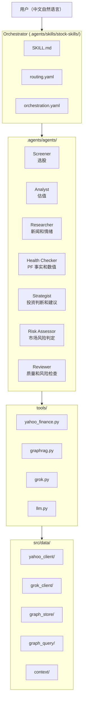

# Architecture

## System Overview

这是一个自然语言优先的投资分析系统，按 Agentic AI Pattern 设计。用户只需用中文表达意图，编排器就会自主选择并启动合适的 agent。

系统可作为 Codex Skills / Claude Code Skills 运行，并集成 Yahoo Finance API（yfinance）、Grok API（X/Web 搜索）、Neo4j（GraphRAG）和多 LLM（Gemini/GPT/Grok）。

## Layer Architecture



## Data Flow

```text
1. 用户发言（中文自然语言）
   ↓
2. Orchestrator (SKILL.md)
   ├─ 通过 routing.yaml 将意图映射到 agent
   ├─ 记录类任务（笔记、交易记录）→ 直接执行（action: direct）
   └─ 分析类任务 → 执行 agent 角色（Codex）/ 启动子 agent（Claude Code）
   ↓
3. Agent (agent.md + examples.yaml)
   ├─ 从 GraphRAG 获取历史上下文
   ├─ 通过 tools/ 获取数据
   ├─ 自主判断、计算和整理输出
   └─ 涉及投资判断的输出 → 自动插入 Reviewer
   ↓
4. Tools (tools/*.py)
   ├─ yahoo_finance: yfinance + 24h JSON cache
   ├─ graphrag: Neo4j GraphRAG (dual-write)
   ├─ grok: Grok API (X/Web 搜索)
   └─ llm: Gemini/GPT/Grok（多 LLM 审查）
   ↓
5. 结果展示 + 自动写入 GraphRAG
   ↓
6. Orchestration (orchestration.yaml)
   ├─ 0 件结果 → 放宽条件并重试
   ├─ Reviewer FAIL → 退回修正
   └─ 达到上限 → 展示当前结果
```

## Design Principles

### 1. Natural Language First

用户界面是中文自然语言。`routing.yaml` 是唯一入口，agent 自主决定参数。

### 2. Agentic AI Pattern

- **Orchestrator** (`SKILL.md`): 判断调用哪个 agent
- **Agents** (`agent.md`): 自主执行判断、计算和整理
- **Tools** (`tools/`): 只负责数据获取，不做判断
- **Few-shot** (`examples.yaml`): 用样例约束 agent 行为

### 3. Dual-Write Pattern (JSON master + Neo4j view)

- JSON 文件是 master 数据源，写入必须成功
- Neo4j 是 view，用于搜索和关联
- Neo4j 失败时通过 graceful degradation 保持功能可用

### 4. Multi-LLM Review & DeepThink 4-Swarm

Reviewer agent 并行启动 GPT/Gemini/Codex or Claude，从不同视角审查。API key 未设置时，由当前 host LLM 自身处理。

DeepThink 模式使用两层模型的 4-Swarm:

- **基础设施层（固定）**: Grok=X/实时市场数据，Gemini=Google 搜索+长上下文；这些能力不可由其他 LLM 替代
- **推理层（动态）**: Devil's Advocate / Scenario Analyst / Lesson Auditor / Portfolio Aligner 按主题分配给 GPT/Gemini/Grok/Codex or Claude
- 当前 host LLM 也作为编排层参与推理，不需要额外启动 agent

### 5. Self-Healing Orchestration

`orchestration.yaml` 提供自主修正循环。筛选 0 件时放宽条件，Reviewer FAIL 时退回修正。只有最终买卖执行需要询问用户。

## Agent Summary

| agent | 职责 | 使用工具 | 默认 LLM |
|:---|:---|:---|:---|
| Screener | 选股和筛选 | yahoo_finance | Codex/Claude |
| Analyst | 估值和低估度判定 | yahoo_finance, graphrag | Codex/Claude |
| Researcher | 新闻、情绪、行业动向 | grok, graphrag | Grok |
| Health Checker | PF 事实和数值，不做判断 | yahoo_finance, graphrag | Codex/Claude |
| Strategist | 投资判断和建议 | yahoo_finance, graphrag | Codex/Claude |
| Risk Assessor | 市场风险判定（risk-on/neutral/risk-off） | yahoo_finance, WebSearch | Codex/Claude |
| Reviewer | 质量、矛盾和风险检查 | llm, graphrag | GPT+Gemini+Codex/Claude |

## Tool Summary

| 工具 | 来源 | 职责 |
|:---|:---|:---|
| yahoo_finance.py | src/data/yahoo_client/ | 股价、基本面、筛选 |
| graphrag.py | src/data/graph_store/ + graph_query/ | Neo4j 知识图谱 |
| grok.py | src/data/grok_client/ | Grok API（X/Web 搜索） |
| llm.py | 直接 API 调用 | Gemini/GPT/Grok 多 LLM |

## Testing & Worktree Tooling（KIK-745/746/747）

干净环境（无 API key、无个人 PF）也能运行集成测试，分为四层:

```text
[Layer A] Unit Tests（约 1381 个，autouse mock）
  python3 -m pytest tests/ -q
  → tests/conftest.py:_block_external_io 自动 mock Neo4j/TEI/Grok

[Layer B] Dry-run（KIK-746，< 1 秒）
  python3 tests/e2e/run_e2e.py --dry-run
  → src/orchestrator/dry_run.py 验证 routing.yaml 一致性和 agent 定义存在性
  → 不调用 LLM/Yahoo Finance，不需要 API key

[Layer C] Mocked E2E（KIK-747，< 1 秒）
  python3 -m pytest tests/e2e/test_mocked.py -q
  → pytest fixture stub tools/llm.py / tools/yahoo_finance.py / tools/grok.py
  → 使用真实 agent.md / examples.yaml，仅替换外部 I/O

[Layer D] Real-API E2E（需要 API key，约 25 秒）
  python3 tests/e2e/run_e2e.py
  → 调用真实 Yahoo Finance / LLM 的最终验证
```

### Worktree Flow（KIK-745）

```text
scripts/setup_worktree.sh KIK-NNN feature-name
  ├─ git worktree add -b feature/kik-NNN-feature-name ~/stock-skills-kikNNN
  ├─ tests/fixtures/sample_portfolio.csv → ~/stock-skills-kikNNN/data/portfolio.csv
  └─ tests/fixtures/sample_cash_balance.json → ~/stock-skills-kikNNN/data/cash_balance.json

禁止将个人 PF（~/stock-skills/data/portfolio.csv）复制到 worktree。
为避免误提交个人标的，只能使用通用测试标的。
```
