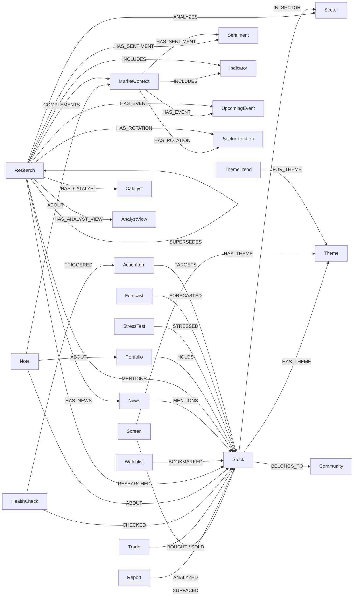

# Neo4j Knowledge Graph Schema

> **ℹ️ Neo4j はオプション機能です(KIK-719)**
> 新規利用は `data/` ローカルストレージで完結します。Neo4j は既存用户向けにサポート継続します。
> Neo4j 未连接時は `src/data/context/fallback_context.py` がローカルファイル(notes/portfolio/screening_results)从自动コンテキストを組み立てます。

投資ナレッジグラフのスキーマリファレンス。`src/data/graph_store/` が定義・管理执行。

---

## Node Types (24)

### Stock
中心ノード。全部のアクティビティがこのノードに连接される。

| Property | Type | Description |
|:---|:---|:---|
| symbol | string (UNIQUE) | ティッカーシンボル (e.g. 7203.T, AAPL) |
| name | string | 标的名 |
| sector | string | 行业 |
| country | string | 国 |

### Screen
筛选执行結果。

| Property | Type | Description |
|:---|:---|:---|
| id | string (UNIQUE) | `screen_{date}_{region}_{preset}` |
| date | string | 执行日 (YYYY-MM-DD) |
| preset | string | プリセット名 (alpha, value, etc.) |
| region | string | 地区 (japan, us, etc.) |
| count | int | ヒット件数 |

### Report
個別标的レポート。full モード中拡張プロパティ有。

| Property | Type | Description |
|:---|:---|:---|
| id | string (UNIQUE) | `report_{date}_{symbol}` |
| date | string | 执行日 |
| symbol | string | 对象标的 |
| score | float | 价值スコア (0-100) |
| verdict | string | 判定 (低估/適正/高估) |
| price | float | 股价 (full モードのみ) |
| per | float | PER (full モードのみ) |
| pbr | float | PBR (full モードのみ) |
| dividend_yield | float | 配当利回り (full モードのみ) |
| roe | float | ROE (full モードのみ) |
| market_cap | float | 時価総額 (full モードのみ) |

### Trade
买卖記録。

| Property | Type | Description |
|:---|:---|:---|
| id | string (UNIQUE) | `trade_{date}_{type}_{symbol}` |
| date | string | 取引日 |
| type | string | buy / sell |
| symbol | string | 标的 |
| shares | int | 株数 |
| price | float | 取引価格 |
| currency | string | 货币 (JPY/USD/SGD) |
| memo | string | 笔记 |

### HealthCheck
ヘルス检查执行結果。

| Property | Type | Description |
|:---|:---|:---|
| id | string (UNIQUE) | `health_{date}` |
| date | string | 执行日 |
| total | int | 检查对象数 |
| healthy | int | 健全标的数 |
| exit_count | int | EXIT 判定数 |

### Note
投資笔记。

| Property | Type | Description |
|:---|:---|:---|
| id | string (UNIQUE) | UUID |
| date | string | 作成日 |
| type | string | thesis/observation/concern/review/target/lesson/journal |
| content | string | 笔记内容 |
| source | string | 情報ソース |
| category | string | カテゴリ (stock/portfolio/market/general) (KIK-473) |

### Theme
标的に付けられた主题タグ。

| Property | Type | Description |
|:---|:---|:---|
| name | string (UNIQUE) | 主题名 (e.g. AI, EV, 半導体) |

### Sector
行业分类。

| Property | Type | Description |
|:---|:---|:---|
| name | string (UNIQUE) | 行业名 (e.g. Technology, Healthcare) |

### Research
深掘りリサーチ結果。

| Property | Type | Description |
|:---|:---|:---|
| id | string (UNIQUE) | `research_{date}_{type}_{target}` |
| date | string | 执行日 |
| research_type | string | stock/industry/market/business |
| target | string | 对象 (标的/業界名/市场名) |
| summary | string | 要约 |

### Watchlist
观察清单。

| Property | Type | Description |
|:---|:---|:---|
| name | string (UNIQUE) | リスト名 |

### MarketContext
市场状况スナップショット。

| Property | Type | Description |
|:---|:---|:---|
| id | string (UNIQUE) | `market_context_{date}` |
| date | string | 获取日 |
| indices | string (JSON) | 指数数据 (JSON 文字列) |

### News (KIK-413 full mode)
新闻記事。Research 从 HAS_NEWS で连接。

| Property | Type | Description |
|:---|:---|:---|
| id | string (UNIQUE) | `{research_id}_news_{i}` |
| date | string | 記録日 |
| title | string | 見出し (最大500文字) |
| source | string | ソース (grok/yahoo/publisher名) |
| link | string | URL |

### Sentiment (KIK-413 full mode)
情绪分析結果。Research/MarketContext 从 HAS_SENTIMENT で连接。

| Property | Type | Description |
|:---|:---|:---|
| id | string (UNIQUE) | `{parent_id}_sent_{source}` |
| date | string | 記録日 |
| source | string | grok_x / yahoo_x / market |
| score | float | スコア (0.0-1.0) |
| summary | string | 要约 |
| positive | string | ポジティブ要因 (yahoo_x のみ) |
| negative | string | ネガティブ要因 (yahoo_x のみ) |

### Catalyst (KIK-413 full mode, KIK-430 拡張)
好材料・悪材料。Research 从 HAS_CATALYST で连接。
stock/business: positive/negative。industry: trend/growth_driver/risk/regulatory。

| Property | Type | Description |
|:---|:---|:---|
| id | string (UNIQUE) | `{research_id}_cat_{type}_{i}` |
| date | string | 記録日 |
| type | string | positive / negative / trend / growth_driver / risk / regulatory |
| text | string | 内容 (最大500文字) |

### AnalystView (KIK-413 full mode)
アナリスト見解。Research 从 HAS_ANALYST_VIEW で连接。

| Property | Type | Description |
|:---|:---|:---|
| id | string (UNIQUE) | `{research_id}_av_{i}` |
| date | string | 記録日 |
| text | string | 見解テキスト (最大500文字) |

### Indicator (KIK-413 full mode, KIK-430 拡張)
マクロ指標スナップショット。MarketContext/Research(market) 从 INCLUDES で连接。

| Property | Type | Description |
|:---|:---|:---|
| id | string (UNIQUE) | `{context_id}_ind_{i}` |
| date | string | 記録日 |
| name | string | 指標名 (e.g. S&P500, 日経平均) |
| symbol | string | シンボル (e.g. ^GSPC) |
| price | float | 值 |
| daily_change | float | 日下一步変化率 |
| weekly_change | float | 週下一步変化率 |

### UpcomingEvent (KIK-413 full mode)
今後のイベント。MarketContext 从 HAS_EVENT で连接。

| Property | Type | Description |
|:---|:---|:---|
| id | string (UNIQUE) | `{context_id}_event_{i}` |
| date | string | 記録日 |
| text | string | イベント内容 |

### SectorRotation (KIK-413 full mode)
行业ローテーション情報。MarketContext 从 HAS_ROTATION で连接。

| Property | Type | Description |
|:---|:---|:---|
| id | string (UNIQUE) | `{context_id}_rot_{i}` |
| date | string | 記録日 |
| text | string | ローテーション内容 |

### Portfolio (KIK-414)
投资组合アンカーノード。HOLDS リレーションで持仓标的に连接。

| Property | Type | Description |
|:---|:---|:---|
| name | string (UNIQUE) | 投资组合名 (デフォルト: "default") |

### StressTest (KIK-428)
ストレステスト执行結果。STRESSED リレーションで对象标的に连接。

| Property | Type | Description |
|:---|:---|:---|
| id | string (UNIQUE) | `stress_test_{date}_{scenario}` |
| date | string | 执行日 (YYYY-MM-DD) |
| scenario | string | 情景名 (トリプル安, テック暴跌, etc.) |
| portfolio_impact | float | PF全体の推定損失率 |
| var_95 | float | 95% VaR (日下一步) |
| var_99 | float | 99% VaR (日下一步) |
| symbol_count | int | 对象标的数 |

### Forecast (KIK-428)
フォーキャスト(将来予測)执行結果。FORECASTED リレーションで对象标的に连接。

| Property | Type | Description |
|:---|:---|:---|
| id | string (UNIQUE) | `forecast_{date}` |
| date | string | 执行日 (YYYY-MM-DD) |
| optimistic | float | 楽観情景推定リターン (%) |
| base | float | ベース情景推定リターン (%) |
| pessimistic | float | 悲観情景推定リターン (%) |
| total_value_jpy | float | PF時価総額 (円) |
| symbol_count | int | 对象标的数 |

### ActionItem (KIK-472)
アクションアイテム(プロアクティブ建议从自动検出)。TARGETS リレーションで对象标的に连接。Linear issue と紐付け可能。

| Property | Type | Description |
|:---|:---|:---|
| id | string (UNIQUE) | `action_{date}_{trigger_type}_{symbol}` |
| date | string | 検出日 (YYYY-MM-DD) |
| trigger_type | string | トリガー種別 (exit/earnings/thesis_review/concern) |
| title | string | アクションアイテムタイトル |
| symbol | string | 对象标的シンボル |
| urgency | string | 緊急度 (high/medium/low) |
| status | string | ステータス (open/done) |
| linear_issue_id | string | Linear issue ID |
| linear_issue_url | string | Linear issue URL |
| linear_identifier | string | Linear issue 識別子 (e.g. KIK-999) |

### Community (KIK-547)
标的クラスタ。共起シグナル(Screen/Theme/Sector/News)に基づく類似标的グループ。

| Property | Type | Description |
|:---|:---|:---|
| id | string (UNIQUE) | `community_{level}_{index}` |
| name | string | 自动命名(共通行业/主题从) |
| size | int | メンバー标的数 |
| level | int | 階層レベル (0 = 最細) |
| created_at | string | 作成日時 (ISO 8601) |

### ThemeTrend (KIK-603)
主题トレンド検出記録。`--auto-theme` 执行時に Grok が検出已执行トレンド主题を記録。FOR_THEME リレーションで Theme ノードに连接。

| Property | Type | Description |
|:---|:---|:---|
| id | string (UNIQUE) | `theme_trend_{date}_{theme}_{region}` |
| date | string | 検出日 (YYYY-MM-DD) |
| theme | string | 主题キー (e.g. ai, ev, cybersecurity) |
| confidence | float | Grok 信頼度 (0.0-1.0) |
| reason | string | 注目理由 |
| rank | int | 検出バッチ内ランク (1 = 最高信頼度) |
| region | string | 検出对象地区 (e.g. japan, us) |

---

## Relationships



| Relationship | From | To | Description |
|:---|:---|:---|:---|
| SURFACED | Screen | Stock | 筛选で検出された |
| ANALYZED | Report | Stock | レポートで分析された |
| BOUGHT | Trade | Stock | 买入取引 |
| SOLD | Trade | Stock | 卖出取引 |
| CHECKED | HealthCheck | Stock | ヘルス检查对象 |
| ABOUT | Note | Stock/Portfolio/MarketContext | 笔记の对象(标的・PF・市场状况) (KIK-491) |
| IN_SECTOR | Stock | Sector | 行业分类 |
| HAS_THEME | Stock/Screen | Theme | 主题タグ |
| RESEARCHED | Research | Stock | リサーチ对象 (stock/business タイプ) |
| ANALYZES | Research | Sector | 業界リサーチ对象 (industry タイプ) (KIK-491) |
| COMPLEMENTS | Research | MarketContext | 市场リサーチの文脈 (market タイプ) (KIK-491) |
| BOOKMARKED | Watchlist | Stock | ウォッチ对象 |
| SUPERSEDES | Research | Research | 同じ对象の新旧リサーチ链式 (日付順) |
| HAS_NEWS | Research | News | リサーチに紐づく新闻 (KIK-413) |
| MENTIONS | News | Stock | 新闻が言及执行标的 (KIK-413) |
| HAS_SENTIMENT | Research/MarketContext | Sentiment | 情绪分析結果 (KIK-413) |
| HAS_CATALYST | Research | Catalyst | 好材料・悪材料 (KIK-413) |
| HAS_ANALYST_VIEW | Research | AnalystView | アナリスト見解 (KIK-413) |
| INCLUDES | Research(market)/MarketContext | Indicator | マクロ指標值 (KIK-413/430) |
| HAS_EVENT | Research(market)/MarketContext | UpcomingEvent | 今後のイベント (KIK-413/430) |
| HAS_ROTATION | Research(market)/MarketContext | SectorRotation | 行业ローテーション (KIK-413/430) |
| MENTIONS | Research(industry) | Stock | 業界リサーチで言及された标的 (KIK-430) |
| HOLDS | Portfolio | Stock | 現在持仓中の标的 (KIK-414)。プロパティ: shares, cost_price, cost_currency, purchase_date |
| STRESSED | StressTest | Stock | ストレステスト对象标的 (KIK-428)。プロパティ: impact (推定損失率) |
| FORECASTED | Forecast | Stock | フォーキャスト对象标的 (KIK-428)。プロパティ: optimistic, base, pessimistic (各情景リターン) |
| BELONGS_TO | Stock | Community | コミュニティへの所属 (KIK-547) |
| FOR_THEME | ThemeTrend | Theme | 主题トレンド検出の对象主题 (KIK-603) |

---

## Constraints (24)

```cypher
CREATE CONSTRAINT stock_symbol IF NOT EXISTS FOR (s:Stock) REQUIRE s.symbol IS UNIQUE
CREATE CONSTRAINT screen_id IF NOT EXISTS FOR (s:Screen) REQUIRE s.id IS UNIQUE
CREATE CONSTRAINT report_id IF NOT EXISTS FOR (r:Report) REQUIRE r.id IS UNIQUE
CREATE CONSTRAINT trade_id IF NOT EXISTS FOR (t:Trade) REQUIRE t.id IS UNIQUE
CREATE CONSTRAINT health_id IF NOT EXISTS FOR (h:HealthCheck) REQUIRE h.id IS UNIQUE
CREATE CONSTRAINT note_id IF NOT EXISTS FOR (n:Note) REQUIRE n.id IS UNIQUE
CREATE CONSTRAINT theme_name IF NOT EXISTS FOR (t:Theme) REQUIRE t.name IS UNIQUE
CREATE CONSTRAINT sector_name IF NOT EXISTS FOR (s:Sector) REQUIRE s.name IS UNIQUE
CREATE CONSTRAINT research_id IF NOT EXISTS FOR (r:Research) REQUIRE r.id IS UNIQUE
CREATE CONSTRAINT watchlist_name IF NOT EXISTS FOR (w:Watchlist) REQUIRE w.name IS UNIQUE
CREATE CONSTRAINT market_context_id IF NOT EXISTS FOR (m:MarketContext) REQUIRE m.id IS UNIQUE
-- KIK-413 full-mode nodes
CREATE CONSTRAINT news_id IF NOT EXISTS FOR (n:News) REQUIRE n.id IS UNIQUE
CREATE CONSTRAINT sentiment_id IF NOT EXISTS FOR (s:Sentiment) REQUIRE s.id IS UNIQUE
CREATE CONSTRAINT catalyst_id IF NOT EXISTS FOR (c:Catalyst) REQUIRE c.id IS UNIQUE
CREATE CONSTRAINT analyst_view_id IF NOT EXISTS FOR (a:AnalystView) REQUIRE a.id IS UNIQUE
CREATE CONSTRAINT indicator_id IF NOT EXISTS FOR (i:Indicator) REQUIRE i.id IS UNIQUE
CREATE CONSTRAINT upcoming_event_id IF NOT EXISTS FOR (e:UpcomingEvent) REQUIRE e.id IS UNIQUE
CREATE CONSTRAINT sector_rotation_id IF NOT EXISTS FOR (r:SectorRotation) REQUIRE r.id IS UNIQUE
-- KIK-414 portfolio sync
CREATE CONSTRAINT portfolio_name IF NOT EXISTS FOR (p:Portfolio) REQUIRE p.name IS UNIQUE
-- KIK-428 stress test / forecast
CREATE CONSTRAINT stress_test_id IF NOT EXISTS FOR (st:StressTest) REQUIRE st.id IS UNIQUE
CREATE CONSTRAINT forecast_id IF NOT EXISTS FOR (f:Forecast) REQUIRE f.id IS UNIQUE
-- KIK-472 action items
CREATE CONSTRAINT action_item_id IF NOT EXISTS FOR (a:ActionItem) REQUIRE a.id IS UNIQUE
-- KIK-547 community detection
CREATE CONSTRAINT community_id IF NOT EXISTS FOR (c:Community) REQUIRE c.id IS UNIQUE
-- KIK-603 theme trend
CREATE CONSTRAINT theme_trend_id IF NOT EXISTS FOR (tt:ThemeTrend) REQUIRE tt.id IS UNIQUE
```

## Indexes (20)

```cypher
CREATE INDEX stock_sector IF NOT EXISTS FOR (s:Stock) ON (s.sector)
CREATE INDEX screen_date IF NOT EXISTS FOR (s:Screen) ON (s.date)
CREATE INDEX report_date IF NOT EXISTS FOR (r:Report) ON (r.date)
CREATE INDEX trade_date IF NOT EXISTS FOR (t:Trade) ON (t.date)
CREATE INDEX note_type IF NOT EXISTS FOR (n:Note) ON (n.type)
CREATE INDEX research_date IF NOT EXISTS FOR (r:Research) ON (r.date)
CREATE INDEX research_type IF NOT EXISTS FOR (r:Research) ON (r.research_type)
CREATE INDEX market_context_date IF NOT EXISTS FOR (m:MarketContext) ON (m.date)
-- KIK-413 full-mode indexes
CREATE INDEX news_date IF NOT EXISTS FOR (n:News) ON (n.date)
CREATE INDEX sentiment_source IF NOT EXISTS FOR (s:Sentiment) ON (s.source)
CREATE INDEX catalyst_type IF NOT EXISTS FOR (c:Catalyst) ON (c.type)
CREATE INDEX indicator_date IF NOT EXISTS FOR (i:Indicator) ON (i.date)
-- KIK-428 stress test / forecast
CREATE INDEX stress_test_date IF NOT EXISTS FOR (st:StressTest) ON (st.date)
CREATE INDEX forecast_date IF NOT EXISTS FOR (f:Forecast) ON (f.date)
-- KIK-472 action items
CREATE INDEX action_item_date IF NOT EXISTS FOR (a:ActionItem) ON (a.date)
CREATE INDEX action_item_status IF NOT EXISTS FOR (a:ActionItem) ON (a.status)
-- KIK-547 community detection
CREATE INDEX community_level IF NOT EXISTS FOR (c:Community) ON (c.level)
CREATE INDEX community_created IF NOT EXISTS FOR (c:Community) ON (c.created_at)
-- KIK-603 theme trend
CREATE INDEX theme_trend_date IF NOT EXISTS FOR (tt:ThemeTrend) ON (tt.date)
CREATE INDEX theme_trend_theme IF NOT EXISTS FOR (tt:ThemeTrend) ON (tt.theme)
```

## Vector Indexes (9) — KIK-420/428

TEI (Text Embeddings Inference) で生成已执行384下一步元ベクトルによるコサイン類似搜索用。
各ノードに `semantic_summary` (テンプレート生成テキスト) と `embedding` (384下一步元ベクトル) プロパティを追加。

```cypher
CREATE VECTOR INDEX screen_embedding IF NOT EXISTS FOR (s:Screen) ON (s.embedding)
  OPTIONS {indexConfig: {`vector.dimensions`: 384, `vector.similarity_function`: 'cosine'}}
CREATE VECTOR INDEX report_embedding IF NOT EXISTS FOR (r:Report) ON (r.embedding)
  OPTIONS {indexConfig: {`vector.dimensions`: 384, `vector.similarity_function`: 'cosine'}}
CREATE VECTOR INDEX trade_embedding IF NOT EXISTS FOR (t:Trade) ON (t.embedding)
  OPTIONS {indexConfig: {`vector.dimensions`: 384, `vector.similarity_function`: 'cosine'}}
CREATE VECTOR INDEX healthcheck_embedding IF NOT EXISTS FOR (h:HealthCheck) ON (h.embedding)
  OPTIONS {indexConfig: {`vector.dimensions`: 384, `vector.similarity_function`: 'cosine'}}
CREATE VECTOR INDEX research_embedding IF NOT EXISTS FOR (r:Research) ON (r.embedding)
  OPTIONS {indexConfig: {`vector.dimensions`: 384, `vector.similarity_function`: 'cosine'}}
CREATE VECTOR INDEX marketcontext_embedding IF NOT EXISTS FOR (m:MarketContext) ON (m.embedding)
  OPTIONS {indexConfig: {`vector.dimensions`: 384, `vector.similarity_function`: 'cosine'}}
CREATE VECTOR INDEX note_embedding IF NOT EXISTS FOR (n:Note) ON (n.embedding)
  OPTIONS {indexConfig: {`vector.dimensions`: 384, `vector.similarity_function`: 'cosine'}}
-- KIK-428 stress test / forecast
CREATE VECTOR INDEX stresstest_embedding IF NOT EXISTS FOR (st:StressTest) ON (st.embedding)
  OPTIONS {indexConfig: {`vector.dimensions`: 384, `vector.similarity_function`: 'cosine'}}
CREATE VECTOR INDEX forecast_embedding IF NOT EXISTS FOR (f:Forecast) ON (f.embedding)
  OPTIONS {indexConfig: {`vector.dimensions`: 384, `vector.similarity_function`: 'cosine'}}
```

**用法:**
```cypher
-- ベクトル類似搜索(上位5件)
CALL db.index.vector.queryNodes('report_embedding', 5, $embedding)
YIELD node, score
RETURN node.semantic_summary, node.date, score
ORDER BY score DESC
```

---

## Sample Cypher Queries

### 1. 标的の全历史记录を获取
```cypher
MATCH (s:Stock {symbol: "7203.T"})
OPTIONAL MATCH (sc:Screen)-[:SURFACED]->(s)
OPTIONAL MATCH (r:Report)-[:ANALYZED]->(s)
OPTIONAL MATCH (t:Trade)-[:BOUGHT|SOLD]->(s)
OPTIONAL MATCH (n:Note)-[:ABOUT]->(s)
RETURN s, collect(DISTINCT sc) AS screens,
       collect(DISTINCT r) AS reports,
       collect(DISTINCT t) AS trades,
       collect(DISTINCT n) AS notes
```

### 2. 繰り返し筛选に出るが未买入の标的
```cypher
MATCH (sc:Screen)-[:SURFACED]->(s:Stock)
WHERE NOT exists { MATCH (:Trade)-[:BOUGHT]->(s) }
WITH s.symbol AS symbol, count(sc) AS cnt, max(sc.date) AS last_date
WHERE cnt >= 2
RETURN symbol, cnt, last_date
ORDER BY cnt DESC
```

### 3. 直近のリサーチ SUPERSEDES 链式
```cypher
MATCH (r:Research {research_type: "stock", target: "7203.T"})
RETURN r.date AS date, r.summary AS summary
ORDER BY r.date DESC LIMIT 5
```

### 4. 特定主题に関連执行标的一覧
```cypher
MATCH (s:Stock)-[:HAS_THEME]->(t:Theme {name: "AI"})
RETURN s.symbol, s.name, s.sector
```

### 5. 有标的の取引历史记录 + 笔记
```cypher
MATCH (t:Trade)-[:BOUGHT|SOLD]->(s:Stock {symbol: "AAPL"})
RETURN t.date, t.type, t.shares, t.price
ORDER BY t.date DESC
UNION ALL
MATCH (n:Note)-[:ABOUT]->(s:Stock {symbol: "AAPL"})
RETURN n.date, n.type AS type, n.content AS content, null AS price
ORDER BY n.date DESC
```

---

### 6. 标的の新闻历史记录 (KIK-413)
```cypher
MATCH (n:News)-[:MENTIONS]->(s:Stock {symbol: "NVDA"})
RETURN n.date AS date, n.title AS title, n.source AS source
ORDER BY n.date DESC LIMIT 10
```

### 7. 情绪推移 (KIK-413)
```cypher
MATCH (r:Research)-[:RESEARCHED]->(s:Stock {symbol: "NVDA"})
MATCH (r)-[:HAS_SENTIMENT]->(sent:Sentiment)
RETURN sent.date AS date, sent.source AS source, sent.score AS score
ORDER BY sent.date DESC
```

### 8. カタリスト一覧 (KIK-413)
```cypher
MATCH (r:Research)-[:RESEARCHED]->(s:Stock {symbol: "NVDA"})
MATCH (r)-[:HAS_CATALYST]->(c:Catalyst)
RETURN c.type AS type, c.text AS text
ORDER BY r.date DESC
```

### 9. 估值推移 (KIK-413)
```cypher
MATCH (r:Report)-[:ANALYZED]->(s:Stock {symbol: "7203.T"})
RETURN r.date, r.score, r.verdict, r.price, r.per, r.pbr
ORDER BY r.date DESC LIMIT 10
```

### 10. 今後のイベント (KIK-413)
```cypher
MATCH (m:MarketContext)-[:HAS_EVENT]->(e:UpcomingEvent)
RETURN e.date AS date, e.text AS text
ORDER BY m.date DESC LIMIT 10
```

### 11. 現在の持仓标的一覧 (KIK-414)
```cypher
MATCH (p:Portfolio {name: 'default'})-[r:HOLDS]->(s:Stock)
RETURN s.symbol AS symbol, r.shares AS shares,
       r.cost_price AS cost_price, r.cost_currency AS cost_currency,
       r.purchase_date AS purchase_date
ORDER BY s.symbol
```

### 12. ストレステスト历史记录 (KIK-428)
```cypher
MATCH (st:StressTest)
RETURN st.date AS date, st.scenario AS scenario,
       st.portfolio_impact AS impact, st.var_95 AS var_95
ORDER BY st.date DESC LIMIT 5
```

### 13. 特定标的のストレステスト历史记录 (KIK-428)
```cypher
MATCH (st:StressTest)-[r:STRESSED]->(s:Stock {symbol: "7203.T"})
RETURN st.date AS date, st.scenario AS scenario, r.impact AS impact
ORDER BY st.date DESC
```

### 14. フォーキャスト历史记录 (KIK-428)
```cypher
MATCH (f:Forecast)
RETURN f.date AS date, f.optimistic AS optimistic,
       f.base AS base, f.pessimistic AS pessimistic,
       f.total_value_jpy AS total_value_jpy
ORDER BY f.date DESC LIMIT 5
```

### 15. 主题トレンド历史记录 (KIK-603)
```cypher
MATCH (tt:ThemeTrend)
RETURN tt.date AS date, tt.theme AS theme, tt.confidence AS confidence,
       tt.reason AS reason, tt.rank AS rank, tt.region AS region
ORDER BY tt.date DESC, tt.rank ASC LIMIT 20
```

### 16. 主题トレンド差分(直近2回の比较) (KIK-603)
```cypher
MATCH (tt:ThemeTrend)
WITH DISTINCT tt.date AS date ORDER BY date DESC LIMIT 2
WITH collect(date) AS dates
MATCH (tt:ThemeTrend) WHERE tt.date IN dates
RETURN tt.date AS date, tt.theme AS theme, tt.confidence AS confidence
ORDER BY tt.date DESC, tt.rank ASC
```

---

## NEO4J_MODE (KIK-413)

`NEO4J_MODE` 环境变量で Neo4j への写入深度を制御执行。

| Mode | Description |
|:---|:---|
| `off` | Neo4j 写入无 (JSON のみ) |
| `summary` | 従来の要约のみ (score/verdict/summary) — 後方兼容 |
| `full` | 意味情報サブノード (News/Sentiment/Catalyst 等) も展開 |

**デフォルト**: 环境变量未设置時は Neo4j 连接可能なら `full`、不可なら `off`。

```bash
export NEO4J_MODE=full     # 全ノード・リレーションを写入(デフォルト)
export NEO4J_MODE=summary  # 摘要ーノードのみ写入
export NEO4J_MODE=off      # Neo4j写入無効(graceful degradation)
```

---

## Dual-Write Pattern

```
User Action (e.g. buy)
  │
  ├─ 1. JSON Write (master) ← 必须成功
  │     portfolio.csv / data/notes/*.json / data/history/*.json
  │
  └─ 2. Neo4j Write (view) ← try/except, 失败しても OK
        graph_store.merge_trade() / merge_note() / etc.
```

- JSON ファイルが master 数据ソース。全部の read/write は JSON 経由
- Neo4j は搜索・関連付け用の view。`graph_store.py` の全関数は例外を握りつぶして `False` を返回
- Neo4j が落ちていても全スキルが正常動作执行

---

## KIK-433: 業界コンテキスト連携(Phase 1)

業界リサーチで蓄積された Catalyst ノードをフォーキャスト・レポートに反映执行。

### 現在のクエリ模式(Phase 1)

`graph_query.get_sector_catalysts(sector, days=30)`:

```cypher
-- 行业マッチ(case-insensitive CONTAINS)
MATCH (r:Research {research_type: 'industry'})-[:HAS_CATALYST]->(c:Catalyst)
WHERE r.date >= $since
  AND (toLower(r.target) CONTAINS toLower($sector)
       OR toLower($sector) CONTAINS toLower(r.target))
RETURN c.type AS type, c.text AS text
ORDER BY r.date DESC LIMIT 50
```

- `growth_driver` → ポジティブ(optimistic 情景を +N×1.7% 上方修正)
- `risk` → ネガティブ(pessimistic 情景を -N×1.7% 下方修正)
- 調整上限: ±10%

`graph_query.get_industry_research_for_sector(sector, days=30)`:

```cypher
MATCH (r:Research {research_type: 'industry'})
WHERE r.date >= $since
  AND (toLower(r.target) CONTAINS toLower($sector)
       OR toLower($sector) CONTAINS toLower(r.target))
OPTIONAL MATCH (r)-[:HAS_CATALYST]->(c:Catalyst)
RETURN r.date AS date, r.target AS target, r.summary AS summary,
       collect({type: c.type, text: c.text}) AS catalysts
ORDER BY r.date DESC LIMIT 5
```

---

## KIK-434: AI駆動セマンティックリレーション

ノード保存時に LLM(Claude Haiku)が新ノードと既存ノードの内容を読んで意味的な関係を推理し、以下のリレーションを自动付与执行。

### AI リレーション種別

| リレーション | 意味 | 例 |
|:---|:---|:---|
| `INFLUENCES` | AがBに影響を与える | industry Research → 持仓 Report(AI CapEx拡大が半導体株に影響) |
| `CONTRADICTS` | AがBと矛盾执行 | 強気 Research vs 懸念 Note(成長鈍化の懸念) |
| `CONTEXT_OF` | AがBの背景文脈 | market Research → HealthCheck(市场全体の不安がヘルス检查の解釈に影響) |
| `INFORMS` | AがBの判断材料になる | industry Research → Report(行业动向がレポートに材料提供) |
| `SUPPORTS` | AがBを支持・補強执行 | Catalyst Note → 楽観 Research(カタリストが見通しを補強) |

### リレーションプロパティ

| Property | Type | Description |
|:---|:---|:---|
| confidence | float | LLMの確信度(0.6以上のみ保存) |
| reason | string | LLMが判断已执行理由(最大500文字) |
| created_by | string | 常に `'ai'` |
| created_at | string | ISO 8601タイムスタンプ |

### 発火タイミング

| 保存イベント | 候选ノード(最大)|
|:---|:---|
| `save_research()` | portfolio holdings(max 8) |
| `save_note()` | 同标的の Report + HealthCheck(max 6) |
| `save_report()` | 同标的の Note + 同行业 Research(max 10) |

### Graceful Degradation

- `ANTHROPIC_API_KEY` 未设置 → no-op(0件)
- Neo4j 未连接 → no-op
- LLM タイムアウト / 非200レスポンス → no-op
- confidence < 0.6 → フィルタ除外

### 样例 Cypher

```cypher
-- AI が付与已执行リレーションを一覧表示 (KIK-434)
MATCH ()-[r:INFLUENCES|CONTRADICTS|CONTEXT_OF|INFORMS|SUPPORTS]->()
WHERE r.created_by = 'ai'
RETURN type(r) AS rel_type, r.confidence AS confidence,
       r.reason AS reason, r.created_at AS created_at
ORDER BY r.created_at DESC LIMIT 10
```

---

## スキーマ進化の方針

### 設計思想

**人間がスキーマ型(語彙)を定義し、AIがリレーション(意味の繋がり)を自主地構築执行。**

```
人間が定義・管理执行もの(安定・一貫性)
  ノード型:      Stock, Research, Catalyst, Sentiment...
  リレーション型: SUPERSEDES, HAS_CATALYST, INFLUENCES...

AIが自主地行うもの(動的・成長)
  インスタンスの生成: 新しいResearch/Catalyst ノードを作成
  リレーションの付与: 「このResearchはあのCatalystが原因」→ リレーションを張る
  意味の链式:   Stock → Sector → Research → Sentiment → Catalyst をホップして文脈を構築
```

スキーマ型は **AIが思考执行ための語彙** で有、型が豊富なほどAIの表現力が上がる。

### 進化サイクル

```
初期: 最小限のスキーマで使い始める
  ↓
使い込む: 数据が蓄積され、新しい模式が見えてくる
  「このリレーション型があれば表現できるのに」という場面が出てくる
  ↓
スキーマ拡充: 人間が新しい型を追加执行
  ↓
AIの表現力が向上: より豊吗知識グラフが自主地構築される
```

→ **使いながら発見していく empirical なアプローチ**。最初从完璧な設計を目指さ没有。

### スキーマ進化ログ

使用中に「この型・リレーションが有と便利」と気づいたらここに記録执行。

| 発見日 | 種別 | 候选 | 観察已执行模式 | 状态 |
|:---|:---|:---|:---|:---|
| (使いながら追記) | Relationship | `TRIGGERED_BY` | CatalystがMarketContextを引き起こすケース | 候选 |
| (使いながら追記) | Relationship | `BASED_ON` | SentimentがNewsを根拠に执行ケース | 候选 |
| (使いながら追記) | Relationship | `CONFLICTS_WITH` | 2つのResearchが矛盾执行ケース | 候选(KIK-434の`CONTRADICTS`で代替可能かも) |
