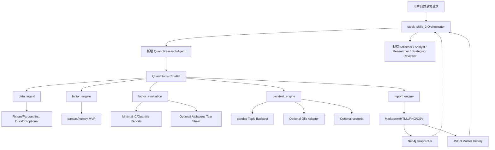
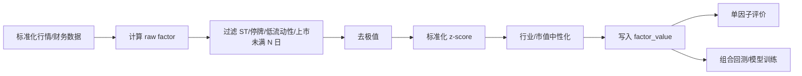

# stock_skills_2 量化功能追加方案

> 目标：在不考虑实盘交易的前提下，把当前 `stock_skills_2` 从“AI 投资助理 / 自然语言研究助手”扩展为“可做中低频因子研究、因子评价、组合回测、研究报告生成”的量化研究系统。  
> 适用市场优先级：**A股为主，日本/美股为辅**。  
> 生成日期：2026-05-19

---

## 0. 结论摘要

`stock_skills_2` 当前强项是 Agentic AI 投资助理：通过 Codex canonical `.agents/skills/stock-skills/` 的 Orchestrator 路由中文自然语言请求，并由 Screener、Analyst、Researcher、Health Checker、Strategist、Risk Assessor、Reviewer 等 Agent 执行选股、估值、新闻、组合健康检查、风险判断和多 LLM 复核。项目主要依赖 yfinance、Grok API、Neo4j GraphRAG 和多 LLM reviewer，并且以 JSON 为 master、Neo4j 为 context/view；`.claude/` 只是 Claude Code mirror。

如果要追加中低频因子投资功能，建议不要从零写完整量化平台，而是采用：

1. **pandas / numpy 作为 MVP 确定性计算核心**：第一阶段先用项目可控的 pandas 管线跑通 fixture/sample 数据、因子计算、IC/Rank IC、分组收益和 TopN 回测，保证无网络、无 API key、无个人 PF 的测试环境也能验证。
2. **Qlib 作为 P1/P2 研究引擎 adapter**：等 pandas MVP 有 snapshot/golden tests 后，再把标准数据转换为 Qlib 格式，复用 Qlib 的组合回测、Recorder 和实验管理能力。不要把 Qlib 安装和格式转换放在 P0 的关键路径上。
3. **Alphalens-reloaded 作为可选单因子评价 adapter**：MVP 先实现最小 IC/Rank IC/分组收益导出；Alphalens 用于增强 tear sheet、换手率和 grouped analysis，并通过 optional dependency 接入。
4. **AKShare / Tushare / BaoStock / yfinance 作为免费或低门槛数据源组合**：外部 provider 放在 sample fixture 闭环之后接入。所有 provider 必须可 mock、可 graceful skip，并先落地到标准 schema 后再进入研究流程。
5. **DuckDB + Parquet 作为本地研究数据仓库**：用于增量数据、横截面查询和跨工具兼容；但 `data/quant/**` 属于本地数据产物，不作为 repo 可提交交付物。
6. **vectorbt 作为 P3 快速参数实验工具**：用于 ETF 动量、少量资产和技术指标网格，不替代主流程。

推荐最终形态：

```text
stock_skills_2
├─ Codex Agent Layer (.agents)      # 保留现有自然语言/AI 研究助手能力
├─ Quant Research API Layer         # 新增：Agent 调用的稳定工具接口
├─ pandas MVP Research Engine       # 新增：因子、评价、TopN 回测的最小闭环
├─ Qlib / Alphalens Adapters        # 新增：增强回测和 tear sheet，非 P0 阻塞项
├─ Data Lake: DuckDB + Parquet      # 新增：本地数据仓库
└─ Neo4j / JSON Knowledge Layer     # 保留：研究记录、结论、上下文记忆
```

---

## 1. 设计原则

### 1.1 LLM 负责“编排与解释”，量化引擎负责“确定性计算”

现有项目的 Agentic AI 结构非常适合自然语言入口、任务拆解、报告生成和复核，但因子计算、回测、收益统计、风险指标和组合构建必须由确定性代码完成。第一阶段的确定性代码应尽量少依赖外部重型框架，先用 pandas/numpy 做可复现闭环；Qlib/Alphalens 在闭环稳定后作为 adapter 接入。

建议职责划分如下：

| 层级 | 负责内容 | 推荐技术 |
|---|---|---|
| Agent 层 | 自然语言理解、任务路由、报告解释、结果复核 | 现有 Codex `.agents` Skills / Agents，`.claude` 作为 mirror |
| 工具 API 层 | 把 Agent 请求转换成稳定的 Python CLI/API 调用 | Typer / argparse / Python functions |
| Quant Engine 层 | 因子计算、因子评价、回测、组合构建 | pandas/numpy MVP + Qlib/Alphalens adapters |
| 数据仓库层 | 行情、财务、行业、指数、股票池、实验结果 | DuckDB + Parquet |
| 知识层 | 研究结论、投资假设、实验摘要、LLM 解释 | JSON master + Neo4j view |

### 1.2 优先做“研究闭环”，不做实盘闭环

本方案不考虑实盘下单、券商 API、订单路由和实时风控，因此第一阶段不需要撮合引擎、交易网关和实时持仓同步。第一阶段应更关注“研究闭环可复现”：固定 fixture、固定股票池、固定因子定义、固定回测规则、固定输出 artifact。Qlib 的组合管理与回测模块适合作为增强阶段，而不是 MVP 的唯一回测入口。

### 1.3 数据源“多源交叉验证”，不追求单一完美数据源

免费数据源通常存在字段变更、接口限流、网页结构变化、复权口径差异和历史财务可得性问题。AKShare 文档也提示其数据来自公开数据源，主要用于学术研究，并建议关注文档和接口更新；yfinance 文档也明确其基于公开 API，且数据使用需要遵守 Yahoo 的使用条款。

因此建议：

- A股行情：AKShare 为主，BaoStock/Tushare 为备份。
- A股财务：Tushare Pro 免费权限可用则优先，AKShare/BaoStock 作为补充。
- 指数/行业/概念：AKShare + Tushare。
- 美股/ETF：yfinance 为主，但仅用于研究和个人用途。
- 所有来源落地后统一字段、统一复权口径、统一交易日历。

---

## 2. 推荐技术栈

### 2.1 核心框架选择

| 组件 | 推荐 | 用途 | 采用理由 |
|---|---|---|---|
| MVP 量化计算核心 | pandas / numpy | 因子、IC/Rank IC、分组收益、TopN 回测 | 依赖轻、可 mock、易写 golden tests，适合先满足本项目无网络/无 API key 的测试约束。 |
| 增强研究框架 | pyqlib(Qlib) | Qlib 数据格式、组合回测、实验记录 | Qlib 官方包名是 `pyqlib`。建议作为 P1/P2 adapter，而不是 P0 阻塞项。 |
| 单因子评价增强 | Alphalens-reloaded | 换手、tear sheet、grouped analysis | 作为 optional dependency 接入；MVP 先保留项目自有最小评价器。 |
| 快速实验补充 | vectorbt | 参数网格、技术信号、轻量组合测试 | P3 使用，适合 ETF 动量和少量资产参数实验。 |
| 数据仓库 | DuckDB + Parquet | 本地轻量数据湖、SQL 查询、批量回测数据读取 | DuckDB 支持直接查询 Parquet/JSON/S3 等数据源，适合本地分析型数据仓库。 |
| 数据处理 | pandas / numpy / pyarrow | 清洗、转换、落地 | 与本项目当前 Python 工具模式一致，便于 CLI 和测试 fixture 复用。 |
| 报告输出 | Markdown / HTML / matplotlib | 研究报告、图表、Agent 汇总 | MVP 先输出 Markdown + PNG；HTML/Plotly 放到增强阶段。 |

### 2.2 数据源选择

| 数据源 | 主要用途 | 优点 | 风险/限制 | 推荐角色 |
|---|---|---|---|---|
| AKShare | A股行情、指数、行业、宏观、基金、期货等 | 接口丰富、无需 token、更新活跃；官方文档显示 2026-05-02 更新，PyPI 版本 1.18.62 于 2026-05-18 发布。 | 网页源接口可能变化；字段中文且来源多样，需要标准化 | A股综合数据主源 |
| Tushare Pro | A股基础信息、交易日历、财务、日线、每日指标 | 官方介绍数据丰富，支持 SDK 与 HTTP Restful，支持多种存储方式。 | 需要 token；部分接口有积分门槛 | 财务和基础信息优先源 |
| BaoStock | A股历史行情、估值字段、ST 标记等 | PyPI 页面说明其提供免费中国股票市场数据，返回 pandas DataFrame，并有历史 K 线示例。 | 更新频率、字段覆盖和维护活跃度需实测 | A股行情备份源 |
| yfinance | 美股、ETF、海外指数 | 官方 README 说明可下载 Yahoo Finance 市场数据，支持 Ticker、Tickers、download、Sector/Industry、Screener 等组件。 | 仅供研究/教育和个人使用，需遵守 Yahoo 条款；不适合作商业生产数据源 | 海外研究辅助源 |

---

## 3. 目标功能范围

### 3.1 第一阶段必须支持的研究问题

系统追加功能后，应能回答以下问题：

```text
1. 某个因子在 A股/日本股/美股 上是否有效？
2. 因子的 IC、Rank IC、ICIR、分组收益、换手率如何？
3. 多因子组合 Value + Quality + Momentum 是否优于基准？
4. 月频调仓 TopN 等权组合在历史上的收益、回撤、换手如何？
5. 加入行业中性、ST 过滤、流动性过滤后结果是否稳定？
6. 不同市场、不同年份、不同市值分组下因子是否失效？
7. LLM 能否自动读取回测结果，生成中文研究报告，并指出过拟合/数据泄漏风险？
```

### 3.2 不做的功能

本方案明确不做：

- 实盘下单；
- 券商 API；
- 高频交易；
- Tick 级数据处理；
- 实时风控；
- 资金划拨和真实持仓同步；
- 生产级行情数据采购；
- 将 LLM 输出直接作为买卖指令。

---

## 4. 总体架构方案



---

## 5. 代码目录追加建议

建议在现有项目根目录下新增以下结构：

```text
stock_skills_2/
├─ tools/
│  ├─ quant_data.py              # 数据下载/更新 CLI
│  ├─ quant_factor.py            # 因子计算 CLI
│  ├─ quant_eval.py              # 最小因子评价 CLI；Alphalens 为 optional adapter
│  ├─ quant_backtest.py          # pandas TopN 回测 CLI；Qlib 为 optional adapter
│  ├─ quant_report.py            # 报告生成 CLI
│  └─ quant_experiment.py        # 实验登记/查询 CLI
│
├─ src/
│  ├─ quant/
│  │  ├─ data/
│  │  │  ├─ providers/
│  │  │  │  ├─ akshare_provider.py
│  │  │  │  ├─ tushare_provider.py
│  │  │  │  ├─ baostock_provider.py
│  │  │  │  └─ yfinance_provider.py
│  │  │  ├─ schema.py
│  │  │  ├─ calendar.py
│  │  │  ├─ universe.py
│  │  │  ├─ adjust.py
│  │  │  ├─ quality_check.py
│  │  │  └─ qlib_converter.py     # P1/P2 adapter，不阻塞 MVP
│  │  │
│  │  ├─ factors/
│  │  │  ├─ base.py
│  │  │  ├─ value.py
│  │  │  ├─ quality.py
│  │  │  ├─ momentum.py
│  │  │  ├─ low_volatility.py
│  │  │  ├─ liquidity.py
│  │  │  ├─ sentiment.py
│  │  │  └─ composite.py
│  │  │
│  │  ├─ evaluation/
│  │  │  ├─ minimal_runner.py
│  │  │  ├─ alphalens_runner.py
│  │  │  ├─ ic_analysis.py
│  │  │  ├─ group_analysis.py
│  │  │  └─ tear_sheet_exporter.py
│  │  │
│  │  ├─ backtest/
│  │  │  ├─ pandas_runner.py
│  │  │  ├─ qlib_runner.py
│  │  │  ├─ strategies.py
│  │  │  ├─ cost_model.py
│  │  │  ├─ benchmark.py
│  │  │  └─ metrics.py
│  │  │
│  │  ├─ portfolio/
│  │  │  ├─ weighting.py
│  │  │  ├─ constraints.py
│  │  │  └─ rebalance.py
│  │  │
│  │  ├─ reports/
│  │  │  ├─ markdown_report.py
│  │  │  ├─ html_report.py
│  │  │  └─ charts.py
│  │  │
│  │  └─ experiments/
│  │     ├─ registry.py
│  │     ├─ config_hash.py
│  │     └─ artifact_store.py
│
├─ data/                          # 本地运行产物；Phase 0 必须更新 .gitignore，参照现有 `data/cache/` 规则
│  ├─ quant/
│  │  ├─ *.parquet                # gitignore
│  │  ├─ *.duckdb                 # gitignore
│  │  ├─ *.csv                    # gitignore（仅 sample/golden 放 tests/fixtures/quant/）
│  │  └─ reports/                 # gitignore（实验产物）
│  │  ├─ raw/
│  │  ├─ normalized/
│  │  ├─ parquet/
│  │  ├─ qlib_data/
│  │  ├─ factors/
│  │  ├─ experiments/
│  │  └─ reports/
│
├─ config/
│  ├─ quant_data_sources.yaml
│  ├─ quant_universe.yaml
│  ├─ quant_factors.yaml
│  ├─ quant_backtest.yaml
│  └─ quant_report.yaml
│
├─ tests/
│  └─ fixtures/
│     └─ quant/                   # 可提交 sample/golden 数据
│
├─ .agents/                       # Codex canonical
│  ├─ agents/
│  │  └─ quant-researcher/
│  │     ├─ agent.md
│  │     └─ examples.yaml
│  └─ skills/
│     └─ stock-skills/
│        ├─ routing.yaml          # 追加：量化研究请求路由
│        └─ orchestration.yaml    # 追加：量化任务失败重试/Reviewer 规则
│
└─ .claude/                       # Claude Code mirror，同步 .agents
   └─ agents/
      └─ quant-researcher/
         ├─ agent.md
         └─ examples.yaml
```

---

## 6. 数据层设计

### 6.1 标准化数据表

所有数据源进入系统后先落到 `data/quant/raw/`，再转换为标准 schema 并落地到 `data/quant/parquet/`。DuckDB 负责统一 SQL 查询，Parquet 负责列式存储和跨工具兼容。DuckDB 官方说明其可直接查询 Parquet、JSON、S3 等数据源，并且具有 Python 客户端，适合作为本地分析数据库。

建议标准表：

| 表名 | 粒度 | 说明 |
|---|---|---|
| `dim_security` | symbol | 证券基础信息：代码、名称、交易所、上市日、退市日、行业 |
| `dim_calendar` | market, date | 交易日历 |
| `daily_bar` | date, symbol | OHLCV、成交额、复权收盘价、换手率 |
| `daily_basic` | date, symbol | PE、PB、PS、股息率、市值、流通市值等 |
| `financial_statement` | report_period, symbol | 利润表、资产负债表、现金流量表 |
| `financial_indicator` | report_period, symbol | ROE、ROA、毛利率、净利率、负债率等 |
| `index_member` | date, index_code, symbol | 指数成分股 |
| `industry_classification` | date, symbol | 行业分类 |
| `suspension_limit` | date, symbol | 停牌、涨跌停、ST 状态 |
| `factor_value` | date, symbol, factor_name | 因子值、zscore、分位数 |
| `experiment_result` | experiment_id | 回测/因子评价结果摘要 |

### 6.2 数据源映射

| 标准数据 | AKShare | Tushare | BaoStock | yfinance |
|---|---|---|---|---|
| A股日线 | 主源 | 备源 | 备源 | 不推荐 |
| A股复权 | 主源 | 主源/备源 | 备源 | 不推荐 |
| A股交易日历 | 可用 | 主源 | 可用 | 不推荐 |
| A股股票列表 | 可用 | 主源 | 可用 | 不推荐 |
| A股财务 | 补充 | 主源 | 补充 | 不推荐 |
| 指数数据 | 主源 | 备源 | 部分可用 | 海外指数可用 |
| ETF/美股 | 补充 | 不推荐 | 不推荐 | 主源 |
| 宏观数据 | 主源 | 主源/补充 | 不推荐 | 不推荐 |

AKShare 的官方介绍说明它覆盖股票、期货、期权、基金、外汇、债券、指数、数字货币等多类金融产品，并主要用于学术研究；Tushare 官方介绍说明其提供股票、基金、期货、数字货币、财务和基金经理等数据，支持 SDK 与 HTTP Restful 接口；BaoStock PyPI 页面说明其提供免费中国股票市场数据；yfinance 官方 README 说明其提供 Yahoo Finance 市场数据下载能力但仅适合研究/教育和个人用途。

### 6.3 数据质量检查

必须实现 `quality_check.py`，每次数据更新后生成报告：

```text
1. 缺失交易日检查
2. 单股票 OHLC 合法性检查
3. 成交量/成交额异常检查
4. 复权价格连续性检查
5. 股票池成分数量异常检查
6. 行业分类缺失检查
7. 财务公告日/报告期逻辑检查
8. 多数据源价格差异检查
```

重点：免费数据源不应直接进入回测，必须先进行标准化、校验和版本冻结。

---

## 7. Qlib Adapter 集成方案（P1/P2，非 P0）

### 7.1 为什么保留 Qlib，但不放入 P0

Qlib 官方文档列出完整的量化研究结构，包括数据层、数据准备、Qlib 格式数据、股票池、Data Handler、Dataset、预测模型、组合管理与回测、Qlib Recorder、评估与结果分析和 PIT 数据库；这比从零搭建长期 factor research/backtest pipeline 更高效。

但对本项目而言，P0 的关键是“无网络、无 API key、无个人 PF 也能跑通的最小闭环”。因此先用 pandas/numpy 固定 sample 数据、因子定义、评价指标和 TopN 回测，再把同一套标准数据与 signal artifact 接到 Qlib。这样 Qlib 安装、平台 wheel、数据格式转换的问题不会阻断 Agent 集成。

### 7.2 Qlib 数据转换

新增 `qlib_converter.py`，把本地 Parquet 数据转换为 Qlib 格式：

```text
Input:
  data/quant/parquet/daily_bar/*.parquet
  data/quant/parquet/daily_basic/*.parquet
  data/quant/parquet/financial_indicator/*.parquet
  data/quant/parquet/dim_calendar/*.parquet
  data/quant/parquet/index_member/*.parquet

Output:
  data/quant/qlib_data/cn_data/
```

转换要求：

```text
1. symbol 格式统一，例如 000001.SZ / 600000.SH
2. date 使用统一交易日历
3. close/open/high/low/volume/amount 字段标准化
4. factor 字段按 Qlib 表达式或 handler 可读取方式组织
5. 股票池 market 文件可生成，例如 csi300.txt、zz500.txt、all_a.txt
```

### 7.3 Qlib 任务配置

建议新增配置目录：

```text
config/qlib_tasks/
├─ factor_only_ic.yaml
├─ topk_dropout_value_quality_momentum.yaml
├─ lightgbm_alpha_model.yaml
├─ enhanced_indexing_csi300.yaml
└─ monthly_rebalance_top100.yaml
```

第一阶段优先实现规则因子和 TopK 策略，不急于上深度学习模型。

---

## 8. 因子库设计

### 8.1 第一批因子

建议第一批只做可解释、低复杂度、适合中低频的因子。

| 类别 | 因子 | 说明 |
|---|---|---|
| Value | BP | book-to-price，优先用 PB 的倒数 |
| Value | EP | earnings-to-price，优先用 PE 的倒数 |
| Value | CFP | operating cash flow / market cap |
| Quality | ROE | 净资产收益率 |
| Quality | Gross Profitability | 毛利 / 总资产 |
| Quality | Debt Ratio | 资产负债率，通常取反向 |
| Momentum | MOM_12_1 | 过去 12 个月排除最近 1 个月动量 |
| Momentum | MOM_6_1 | 过去 6 个月排除最近 1 个月动量 |
| Low Vol | VOL_60D | 过去 60 日收益波动率，通常取反向 |
| Liquidity | TURNOVER_20D | 过去 20 日换手率均值 |
| Liquidity | AMIHUD | 非流动性指标，通常取反向 |
| Size | LOG_MKT_CAP | 市值因子，用于控制暴露 |

### 8.2 因子标准输出

每个因子计算后统一输出：

```text
字段：
  date
  symbol
  factor_name
  raw_value
  winsorized_value
  zscore
  industry_neutral_zscore
  percentile
  coverage_flag
  source_version
```

### 8.3 因子处理流程



---

## 9. Alphalens Adapter 单因子评价方案（增强阶段）

### 9.1 使用方式

MVP 先使用项目自有最小评价器，输出 IC、Rank IC、分组收益和 coverage。Alphalens 的标准流程是：准备 factor values 与 pricing data，调用 `get_clean_factor_and_forward_returns()` 生成标准 factor_data，然后调用 `create_full_tear_sheet()` 生成完整分析；该能力适合作为增强阶段的 tear sheet adapter。

### 9.1.1 Golden 校准（关键）

自建最小评价器和 Alphalens 在 IC 计算、forward return 日期对齐、NaN 处理、多周期 quantile 构建上可能产生微小差异。为避免 MVP 结论与后续 Alphalens 结果不一致，必须在 Phase 3 开发期间完成校准：

```text
1. 用 tests/fixtures/quant 的固定 sample 数据，同时跑 minimal_runner 和 Alphalens
2. 将 Alphalens 的 ic_summary 和 quantile_returns 作为 golden 保存到 tests/fixtures/quant/
3. 最小评价器的输出与 golden 的差异必须在 ±0.01 以内（IC 均值、分组收益均值）
4. 如果 Alphalens 在开发环境装不上，至少用纯 numpy/pandas 手动计算一组预期值作为 golden
5. 校准脚本放在 tests/quant/evaluation/test_golden_calibration.py，可重复运行
```

不满足此条件时，`minimal_runner` 不应被用于产生研究结论。

### 9.2 输出指标

每个因子必须输出以下指标：

```text
1. IC Mean
2. IC Std
3. ICIR
4. Rank IC Mean
5. Rank ICIR
6. IC Positive Ratio
7. Quantile 1-5 Forward Return
8. Long-Short Spread
9. Turnover by Quantile
10. Factor Autocorrelation
11. By-year IC
12. By-industry IC
13. By-market-cap-group IC
```

### 9.3 默认 forward return 周期

```text
A股：5D, 10D, 20D, 60D
日本股/美股：5D, 20D, 60D
```

原因：中低频因子投资通常关注周频/月频/季频收益，不应过度依赖 1D 噪音。

### 9.4 输出文件

```text
data/quant/reports/factor_eval/
├─ factor=momentum_12_1_market=cn_period=20150101_20251231/
│  ├─ summary.json
│  ├─ ic_timeseries.csv
│  ├─ quantile_return.csv
│  ├─ turnover.csv
│  ├─ tear_sheet.html
│  ├─ tear_sheet.png
│  └─ report.md
```

---

## 10. 回测方案

### 10.1 第一阶段策略

优先实现最朴素、可解释的横截面策略：

```text
策略 1：单因子 TopN 等权
策略 2：多因子综合分 TopN 等权
策略 3：行业中性 TopN 等权（增强阶段）
策略 4：TopK-Dropout 组合（Qlib adapter 阶段）
```

MVP 使用 pandas TopN 回测。Qlib 文档列出 TopkDropoutStrategy、EnhancedIndexingStrategy 等已实现策略，并覆盖组合管理与回测模块；这些能力适合在 pandas artifact 稳定后接入，用于验证和扩展，而不是替代 P0 最小回测。

### 10.2 MVP 默认回测参数

```yaml
market: cn
universe: sample_a
benchmark: sample_benchmark
start_date: 2024-01-01
end_date: 2024-12-31
rebalance_frequency: monthly
holding_count: 5
transaction_cost:
  buy_cost: 0.0015
  sell_cost: 0.0025
  min_cost: 5
constraints:
  exclude_st: true
  exclude_suspended: true
  min_listing_days: 0
  min_avg_turnover_amount_20d: 0
  max_single_weight: 0.25
  industry_neutral: false
```

真实全市场参数（CSI300/CSI500、Top50/Top100/Top200、流动性过滤、行业中性）放到 Provider/Qlib/稳健性增强阶段。

### 10.3 回测结果指标

```text
收益类：
  Annual Return
  Cumulative Return
  Excess Return
  Monthly Win Rate

风险类：
  Annual Volatility
  Sharpe Ratio
  Sortino Ratio
  Max Drawdown
  Calmar Ratio

交易类：
  Turnover
  Average Holding Days
  Transaction Cost
  Number of Holdings

归因类：
  Industry Exposure
  Size Exposure
  Value/Quality/Momentum Exposure
  Yearly Return
  Monthly Return Heatmap
```

---

## 11. Agent 层追加方案

### 11.0 Quant Researcher 与现有 Agent 的协作设计（核心）

**Quant Researcher 的角色定位是「量化证据提供者」，不是独立的投资建议来源。**

现有 Agent 体系已有 Strategist（投资判断）和 Analyst（个股/ETF 分析）。Quant Researcher 的职责是为这两个 Agent 提供经过确定性计算的量化证据（因子有效性、回测表现、稳健性指标），而不是替代它们做最终决策。这一边界必须在 agent.md 和 orchestration.yaml 中明确编码。

#### 11.0.1 协作数据流

```text
用户请求分类：

类型 A：纯量化问题（”测试动量因子 IC”、”跑一个 BP+动量回测”）
  → Quant Researcher 独立执行
  → 输出 artifact（metrics.json + report.md + experiment_id）
  → Reviewer 检查 artifact 可追溯性和假设完整性
  → 禁止输出买卖建议或「应该买/卖」类结论

类型 B：投资判断 + 量化证据（”这个策略好不好？跑个回测看看”）
  → Quant Researcher 先产出 artifact
  → Strategist 读取 artifact，结合基本面/市场判断给出建议
  → Strategist 必须引用 experiment_id 和关键指标，不得编造数字
  → Reviewer 检查 Strategist 是否正确使用了量化证据（不夸大、不选择性使用）

类型 C：个股分析 + 因子暴露（”分析丰田，同时看看动量和价值因子暴露”）
  → Analyst 做估值/基本面分析
  → Quant Researcher 查询该股票的因子 zscore/percentile/行业分位数
  → Analyst 将因子暴露纳入报告的「量化视角」小节
  → Reviewer 检查因子暴露数值是否与 artifact 一致

类型 D：组合诊断 + 量化归因（”PF 的风险暴露怎么样？”）
  → Health Checker 给出持仓和权重
  → Quant Researcher 计算组合在各因子上的加权暴露
  → Strategist 基于暴露数据判断是否需要调整
  → 如因子暴露偏离配置目标 > 0.5σ，Reviewer 自动触发（🔒 auto）
```

#### 11.0.2 Agent 间接口约定

**Quant Researcher → Strategist 接口**：

| 传给 Strategist | 格式 | 说明 |
|---|---|---|
| experiment_id | string | 强制引用，可追溯 |
| metrics 摘要 | dict（来自 metrics.json） | annual_return, sharpe, max_drawdown, turnover |
| 回测假设 | 清单 | 数据区间、股票池、调仓频率、成本、过滤条件 |
| 风险标注 | 清单 | 未来函数、幸存者偏差、样本不足、过拟合标志 |

Strategist 使用时必须遵守：
1. 引用 metrics 时必须标注 experiment_id 和「回测结果，不代表未来表现」
2. 如果 registry 中没有对应实验，Strategist 必须说「该策略缺乏回测验证」，不得估计收益
3. 当 Strategist 的判断与量化证据矛盾（如 Strategist 看好但回测 Sharpe < 0），必须主动标注矛盾，触发 Reviewer

**Quant Researcher → Analyst 接口**：

| 传给 Analyst | 格式 | 说明 |
|---|---|---|
| factor_exposure | {factor_name: {zscore, percentile, industry_percentile}} | 单股票多因子快照 |
| coverage_flag | bool | 该股票是否在因子覆盖范围内 |
| data_date | date | 因子数据的 as-of 日期 |

Analyst 使用时必须遵守：
1. 因子暴露放在分析报告「量化因子暴露」小节，不与估值判断混淆
2. 如果该股票不在当前因子覆盖范围内，标注「无因子覆盖数据」
3. 不把因子暴露直接等同于「好/坏」，只陈述事实：该股票在动量因子上处于第 X 分位

**Quant Researcher → Reviewer 接口**：

| Reviewer 检查项 | 来源 |
|---|---|
| artifact 可追溯性（12 项清单） | 见 11.3 |
| Strategist 引用的数字是否与 metrics.json 一致 | artifact vs Agent 输出 |
| 是否存在选择性使用有利数据 | 对比完整 metrics vs 报告中引用的子集 |
| Quant Researcher 是否输出了买卖建议（违规） | agent.md 禁止条款 |

#### 11.0.3 Orchestration 规则

在 `.agents/skills/stock-skills/orchestration.yaml` 中新增：

```yaml
# === Quant Researcher 协作规则 ===

# 类型 B：策略问题同时触发 quant + strategist
quant_on_strategy_question:
  when: “用户请求同时包含策略回测和投资判断意图”
  chain:
    - quant-researcher   # 先产出 artifact
    - strategist          # 基于 artifact + 基本面判断
  reviewer: auto          # 🔒 策略结论强制 reviewer
  fallback: “若 quant 失败，strategist 继续但标注「缺乏回测验证」”

# 类型 C：个股分析 + 因子暴露
quant_on_stock_analysis:
  when: “Analyst 执行且用户请求包含因子/量化关键词”
  chain:
    - quant-researcher   # 先查因子暴露
    - analyst             # 纳入分析报告
  reviewer: on_demand     # 🔍 按需

# 类型 D：PF 诊断 + 因子归因
quant_on_pf_diagnosis:
  when: “Health Checker 执行且涉及因子暴露/风格归因”
  chain:
    - health-checker      # 持仓和权重
    - quant-researcher    # 计算因子暴露
    - strategist          # 判断和建议
  reviewer: auto          # 🔒 暴露偏离 > 0.5σ 时自动

# Quant Researcher 独立执行（类型 A）
quant_standalone:
  when: “纯量化研究请求，不含投资判断”
  agent: quant-researcher
  reviewer: on_demand     # 🔍 按需
  post_actions:
    - “artifact 写入 data/quant/experiments/”
    - “summary 写入 data/history/quant/*.json”
    - “Neo4j 写入 optional”
```

#### 11.0.4 必须避免的协作反模式

| 反模式 | 为什么错 | 预防机制 |
|---|---|---|
| Quant Researcher 直接说「建议买入」 | 越权，量化回测不是投资建议 | agent.md 禁止条款 + Reviewer 自动检查 |
| Strategist 在无 artifact 时编造回测收益 | LLM 幻觉，数字无来源 | Strategist 必须引用 experiment_id，Reviewer 验证 |
| Analyst 用因子暴露替代估值判断 | 因子分位数 ≠ 估值高低 | Analyst agent.md 明确因子暴露是小节，不是主结论 |
| Quant 和 Strategist 各自输出矛盾结论 | 用户困惑，信任崩塌 | chain 规则确保顺序；强制标注矛盾 |
| 选择性引用有利 IC 而忽略不利 IC | 确认偏误，研究不诚实 | Reviewer 对比完整 metrics vs 报告引用 |

---

### 11.1 新增 Quant Researcher Agent

新增 Codex canonical agent，并同步 Claude Code mirror：

```text
.agents/agents/quant-researcher/agent.md
.agents/agents/quant-researcher/examples.yaml
.claude/agents/quant-researcher/agent.md       # mirror
.claude/agents/quant-researcher/examples.yaml  # mirror
```

`agent.md` 核心内容：

```text
角色：
  负责调用量化研究工具，执行因子计算、因子评价、组合回测、实验对比和研究报告生成。
  你是「量化证据提供者」，不是投资顾问。你的输出是其他 Agent（Strategist/Analyst）的输入材料。

允许输出的结论类型：
  ✅ “momentum_12_1 因子在 2022-2024 年 A 股上的 Rank IC 均值为 0.05，ICIR 为 0.6”
  ✅ “BP+动量+低波 composite 在回测期间 Sharpe 为 1.2，最大回撤 15%”
  ✅ “该因子在 small_cap 分组中 IC 显著高于 large_cap”
  ✅ “2023 年该策略表现不佳，超额收益为 -8%”

禁止输出的结论类型：
  ❌ “建议买入”、”值得投资”、”推荐配置” 等买卖/配置建议
  ❌ 绕过 quant tools 手工编造回测结果
  ❌ 在数据不足（coverage < 80%、样本 < 30 只股票、回测 < 1 年）时输出确定性结论
  ❌ 把相关性说成因果（”因子有效所以会涨”）
  ❌ 在没有 experiment_id 的情况下引用具体数值

必须：
  引用 experiment_id。
  输出数据区间、股票池、调仓频率、成本假设、过滤条件。
  明确提示数据源限制、幸存者偏差、未来函数风险。
  当被 Strategist/Analyst 调用时，按 11.0.2 的接口约定传递结构化数据。
  当 sample 数据不足以支撑统计结论时，明确说「样本不足，这不构成有效研究结论」。
```

### 11.2 routing.yaml 追加示例

按当前 `routing.yaml` 的 flat examples 风格写入，并使用 pattern/header 扩展字段（与现有规范兼容）：

```yaml
# === 纯量化研究（类型 A） ===
- intent: “测试动量因子在A股是否有效”
  agent: quant-researcher
  pattern: B
  header: “🎯 [quant-researcher] 因子评价”

- intent: “计算BP因子的IC和分组收益”
  agent: quant-researcher
  pattern: B
  header: “🎯 [quant-researcher] 因子IC与分组收益”

- intent: “用BP、动量和低波做月频回测”
  agent: quant-researcher
  pattern: B
  header: “🎯 [quant-researcher] 量化回测”

# === 策略判断 + 量化（类型 B）=== 
# 此类请求应走 chain: quant-researcher → strategist
- intent: “这个多因子策略在A股表现怎么样”
  agent: quant-researcher
  chain: strategist
  pattern: C
  header: “🎯 [quant-researcher → strategist] 策略评估”

- intent: “跑个回测看看这个组合好不好”
  agent: quant-researcher
  chain: strategist
  pattern: C
  header: “🎯 [quant-researcher → strategist] 组合回测与判断”

# === 个股 + 因子暴露（类型 C）===
- intent: “分析这只股票的因子暴露”
  agent: analyst
  chain: quant-researcher
  pattern: C
  header: “🎯 [analyst + quant-researcher] 个股分析与因子暴露”

# === 实验查询 ===
- intent: “把刚才的回测生成研究报告”
  agent: quant-researcher
  pattern: B
  header: “🎯 [quant-researcher] 量化研究报告”

- intent: “列出最近的回测实验”
  agent: quant-researcher
  pattern: A
  header: “🎯 [quant-researcher] 实验查询”
```

说明：
- 当前 `src/orchestrator/dry_run.py` 按每条 `intent` 文本匹配。若 intent 文本与现有 screener/analyst 的 intent 有交集，需要做消歧处理（长匹配优先，或增加 `quant` 关键词的加分权重）。
- `config/tools.yaml` 需要新增 quant tools 的函数登记（见 12 节 CLI），使 Agent 能发现可用工具。
- 同时在 `src/orchestrator/dry_run.py::_expected_tools_for_agent()` 中为 `quant-researcher` 增加 `quant_factor.compute`、`quant_eval.run`、`quant_backtest.run`、`quant_report.generate`、`quant_experiment.list`。

### 11.3 Reviewer 强制检查项

现有项目已经有 Reviewer 和多 LLM review 机制；该机制应扩展到量化研究输出。量化报告的 Reviewer 角色分两层：

**Layer 1：Quant Researcher 独立输出时的 Reviewer（检查 artifact 完整性）**

```text
 1. 是否有 experiment_id
 2. 是否有数据区间
 3. 是否说明股票池
 4. 是否说明交易成本
 5. 是否说明调仓频率
 6. 是否说明是否行业中性
 7. 是否存在未来函数风险
 8. 是否存在幸存者偏差风险
 9. 是否有样本外检验
10. 是否把相关性误写成因果关系
11. 是否输出了买卖建议（违规检查）
12. sample 数据是否不足以支撑统计结论（样本量/时间跨度检查）
```

**Layer 2：Quant Researcher 被 Strategist/Analyst 引用时的 Reviewer（检查引用一致性）**

```text
13. Strategist 引用的收益率/Sharpe/MaxDD 是否与 metrics.json 一致
14. 是否选择性引用有利指标而忽略不利指标
15. 当量化证据与 Strategist 判断矛盾时，是否标注了矛盾
16. Strategist 是否在没有 artifact 的情况下编造了量化数据
```

---

## 12. CLI/API 设计

### 12.1 数据更新（MVP: fixture）

```bash
conda run -n stock-skills-2 python tools/quant_data.py update \
  --market cn \
  --source fixture \
  --start 2024-01-01 \
  --end 2024-12-31 \
  --tables daily_bar,daily_basic,dim_security,calendar
```

### 12.2 因子计算

```bash
conda run -n stock-skills-2 python tools/quant_factor.py compute \
  --market cn \
  --universe sample_a \
  --factors value_bp,momentum_12_1,lowvol_60d \
  --start 2024-01-01 \
  --end 2024-12-31
```

### 12.3 单因子评价（MVP: minimal runner）

```bash
conda run -n stock-skills-2 python tools/quant_eval.py run \
  --market cn \
  --universe sample_a \
  --factor momentum_12_1 \
  --periods 5,20,60 \
  --start 2024-01-01 \
  --end 2024-12-31 \
  --output data/quant/reports/factor_eval
```

### 12.4 pandas TopN 回测（MVP）

```bash
conda run -n stock-skills-2 python tools/quant_backtest.py run \
  --market cn \
  --universe sample_a \
  --score composite_v1 \
  --strategy topn_equal_weight \
  --topn 5 \
  --rebalance monthly \
  --start 2024-01-01 \
  --end 2024-12-31
```

### 12.5 报告生成

```bash
conda run -n stock-skills-2 python tools/quant_report.py generate \
  --experiment-id EXP_20260519_001 \
  --format markdown \
  --with-llm-summary true
```

---

## 13. 配置文件示例

### 13.1 `config/quant_data_sources.yaml`

```yaml
markets:
  cn:
    primary:
      daily_bar: akshare
      daily_basic: tushare
      financial_indicator: tushare
      index_member: akshare
      calendar: tushare
    fallback:
      daily_bar: [baostock, tushare]
      daily_basic: [akshare, baostock]
  us:
    primary:
      daily_bar: yfinance
      etf: yfinance
    fallback: []

storage:
  raw_dir: data/quant/raw
  parquet_dir: data/quant/parquet
  duckdb_path: data/quant/quant.duckdb
  qlib_dir: data/quant/qlib_data
```

### 13.2 `config/quant_factors.yaml`

```yaml
factors:
  value_bp:
    enabled: true
    direction: positive
    source: daily_basic
    formula: inverse_pb
  momentum_12_1:
    enabled: true
    direction: positive
    source: daily_bar
    lookback_months: 12
    skip_recent_months: 1
  lowvol_60d:
    enabled: true
    direction: negative
    source: daily_bar
    lookback_days: 60

processing:
  winsorize:
    method: mad
    n: 3
  standardize:
    method: zscore
  neutralize:
    industry: false
    size: false
```

### 13.3 `config/quant_backtest.yaml`

```yaml
backtest:
  market: cn
  universe: sample_a
  benchmark: sample_benchmark
  start_date: 2024-01-01
  end_date: 2024-12-31
  rebalance_frequency: monthly
  strategy: topn_equal_weight
  topn: 5
  transaction_cost:
    buy_cost: 0.0015
    sell_cost: 0.0025
    min_cost: 5
  filters:
    exclude_st: true
    exclude_suspended: true
    min_listing_days: 0
    min_avg_amount_20d: 0
  constraints:
    max_single_weight: 0.03
    industry_neutral: false
```

---

## 14. 实验管理与报告

### 14.1 实验 ID 规则

```text
EXP_YYYYMMDD_HHMMSS_{market}_{task_type}_{short_hash}
```

示例：

```text
EXP_20260519_145900_cn_factor_eval_a1b2c3
EXP_20260519_150300_cn_backtest_d4e5f6
```

### 14.2 每次实验必须保存

```text
1. config.yaml
2. data_version.json
3. universe_snapshot.csv
4. factor_snapshot.parquet
5. metrics.json
6. charts/*.png
7. report.md
8. reviewer_result.json
```

### 14.3 报告模板

```text
# 因子/策略研究报告

## 1. 实验摘要
- Experiment ID
- 市场
- 股票池
- 数据区间
- 调仓频率
- 交易成本
- 数据源

## 2. 因子定义
- 因子公式
- 数据字段
- 去极值/标准化/中性化方法

## 3. 单因子评价
- IC / Rank IC
- 分组收益
- 换手率
- 分年度表现
- 分行业表现

## 4. 组合回测
- 收益曲线
- 超额收益
- 最大回撤
- Sharpe / Calmar
- 换手率

## 5. 稳健性检查
- 分年份
- 分市值组
- 分行业
- 成本敏感性
- TopN 敏感性

## 6. Reviewer 检查
- 数据泄漏风险
- 幸存者偏差风险
- 过拟合风险
- 样本不足风险

## 7. 结论
- 是否值得继续研究
- 下一步实验建议
```

---

## 15. 实施路线图

### Phase 0：环境与依赖整理，预计 2～3 天

目标：让项目能安装并运行量化依赖。

任务：

```text
1. 建立 `requirements-quant.txt`，并区分 core / optional 依赖
2. core 只放 pandas、numpy、pyarrow、matplotlib、pyyaml；`pyqlib`、alphalens-reloaded、AKShare/Tushare/BaoStock、DuckDB、vectorbt 全部 optional
3. 固定 `stock-skills-2` conda 环境下的 Python 版本和依赖版本，并加入 `pip check`
4. 建立 `data/quant` 本地产物目录，但不把真实数据提交到 repo
5. 建立 `tests/fixtures/quant`，用于可提交 sample/golden 数据
6. 建立基本配置文件和 CLI stub
```

验收：

```text
conda run -n stock-skills-2 python tools/quant_data.py --help
conda run -n stock-skills-2 python tools/quant_factor.py --help
conda run -n stock-skills-2 python tools/quant_eval.py --help
conda run -n stock-skills-2 python tools/quant_backtest.py --help
```

### Phase 1：Fixture + 数据 schema MVP，预计 3～5 天

目标：先用固定 sample universe 建立标准 schema、读写、质量检查和 golden tests，不依赖外部 provider。

任务：

```text
1. `tests/fixtures/quant/sample_daily_bar.csv`
2. `tests/fixtures/quant/sample_daily_basic.csv`
3. 字段标准化 schema
4. Parquet/CSV 读写
5. 最小数据质量检查
6. `data_version.json` / manifest hash
```

验收：

```text
1. 不联网也能跑通 schema + storage + quality_check 测试
2. sample universe 能生成 `daily_bar` / `daily_basic`
3. golden file 能固定 row count、date range、hash
4. pytest 不读取个人 PF，也不需要 API key
```

### Phase 2：单因子库 + 最小评价器，预计 1 周

目标：完成基础因子计算与单因子评价。

任务：

```text
1. 实现 `momentum_12_1`、`lowvol_60d`、`value_bp`
2. 实现去极值、zscore、percentile
3. 实现最小 IC / Rank IC / quantile return
4. 生成 `factor_summary.json` 和 `report.md`
5. 保存 factor evaluation experiment
```

验收：

```text
1. `momentum_12_1` 可输出 IC 和分组收益
2. `value_bp` 对 PB<=0 有明确 NaN 处理
3. `lowvol_60d` 方向和 zscore 可验证
4. 每个因子自动生成 `report.md`
```

### Phase 3：pandas TopN 回测，预计 1 周

目标：完成不依赖 Qlib 的规则因子组合回测。

任务：

```text
1. pandas TopN 等权策略
2. 多因子 composite score
3. 月频调仓
4. 成本模型
5. 回测指标导出
6. Markdown 报告
```

验收：

```text
1. sample universe 可跑固定区间回测
2. 输出收益曲线、回撤、换手率、年度收益
3. 支持 benchmark 对比
4. 同一 config + 同一 data_version 重跑结果一致
```

### Phase 4：实验管理 + Agent 集成，预计 1 周

目标：让用户能用自然语言触发量化任务。

任务：

```text
1. 新增 `.agents/agents/quant-researcher`
2. 同步 `.claude/agents/quant-researcher` mirror
3. 修改 `.agents/skills/stock-skills/routing.yaml`
4. 更新 `src/orchestrator/dry_run.py` 的 quant expected tools
5. 新增 mocked E2E 场景
6. Reviewer 量化检查清单
7. 报告 summary 写入 `data/history/quant/*.json`；Neo4j 写入为 optional
```

验收：

```text
用户输入：
  “测试 A股 sample 股票池的 momentum_12_1 因子，2024 年，看 IC 和分组收益”

系统执行：
  conda run -n stock-skills-2 python tools/quant_factor.py compute
  conda run -n stock-skills-2 python tools/quant_eval.py run
  conda run -n stock-skills-2 python tools/quant_report.py generate

系统输出：
  experiment_id + report.md + summary + reviewer_result
```

### Phase 5：Provider / Qlib / Alphalens 增强，预计 2～4 周

目标：提高研究可信度。

任务：

```text
1. AKShare / BaoStock / Tushare provider
2. DuckDB + Parquet 增量数据仓库
3. Alphalens-reloaded adapter
4. pyqlib(Qlib) adapter
5. 分年份/分市值/分行业稳健性
6. 成本、TopN、调仓频率敏感性
7. walk-forward 分析
8. 多市场扩展到日本/美股
```

---

## 16. 风险与注意事项

### 16.1 数据偏差风险

免费数据源很难完全解决 survivorship bias、point-in-time 财务数据、退市股和历史指数成分问题。Qlib 文档中有 PIT 数据库相关主题，说明 PIT 是专业量化研究的重要问题；本项目初期可以先做近似处理，但报告中必须明确标注数据限制。

### 16.2 yfinance 使用限制

yfinance 官方 README 明确说明它不是 Yahoo 官方认可工具，使用 Yahoo 的公开 API， intended for research and educational purposes，并提醒 Yahoo Finance API intended for personal use only；因此不能把 yfinance 作为商业生产数据源。

### 16.3 AKShare 接口稳定性

AKShare 文档说明其基于公开网页数据源，且由于目标网站变化需要持续维护接口，用户需要经常更新到最新版本并关注文档更新；因此必须做 Provider 层隔离和数据质量检查。

### 16.4 Tushare 权限差异

Tushare Pro 虽然提供大量数据并支持 SDK/HTTP，但部分接口可能需要 token 和积分门槛；因此设计上必须允许 AKShare/BaoStock fallback，不能把所有核心流程绑定到单一 Tushare 接口。

### 16.5 LLM 幻觉风险

所有回测结果必须来自 `experiment_result` 和 `metrics.json`，Agent 不得编造收益率、IC、夏普率、最大回撤等数值。Reviewer 必须检查报告中的所有关键数值是否能在 artifact 中找到。

---

## 17. 最小可行版本 MVP

如果只用 2～3 周做出可演示版本，建议范围收敛为：

```text
市场：A股 sample universe
数据源：tests/fixtures/quant 固定样本；外部 provider 后置
股票池：sample_a（50~100 只股票，覆盖 2~3 年，如 2022-01 至 2024-12）
  - 为什么要 50~100 只：30 只股票分 5 组后每组仅 6 只，分组收益统计不稳健
  - 为什么要 2~3 年：1 年数据无法产生有意义的 IC 统计（至少需要 24 个截面）
  - 数据来源：用 yfinance 下载一次后固化到 tests/fixtures/quant/，之后不再依赖网络
因子：BP、Momentum_12_1、LowVol_60D
评价：项目自有最小 IC / Rank IC / 分组收益，经过 Alphalens golden 校准（见 9.1.1）
回测：pandas 月频 TopN 等权（Top5~Top10，取决于 sample 大小）
报告：Markdown
Agent：`.agents/agents/quant-researcher` 自然语言触发，遵守 11.0 协作边界
```

MVP 成功标准：

```text
1. 用户一句话触发某个因子评价
2. 系统读取固定 sample/golden 数据（不联网、不需 API key）
3. 系统计算因子，覆盖率 > 80%
4. 系统生成最小因子评价报告，IC/Rank IC 与 Alphalens golden 偏差 < 0.01
5. 系统运行 pandas TopN 回测，同一 config+data_version 重跑结果一致
6. 系统输出 Markdown 研究报告，关键数值可追溯到 metrics.json
7. Reviewer 标出数据偏差和过拟合风险
8. Quant Researcher 未输出买卖建议（违规检查通过）
9. `conda run -n stock-skills-2 python -m pytest tests/ -q` 通过
10. `conda run -n stock-skills-2 python tests/e2e/run_e2e.py --dry-run` 通过
```

---

## 18. 推荐最终目标状态

当上述功能稳定后，`stock_skills_2` 可形成三个层次：

```text
第一层：AI 投资研究助理
  - 自然语言理解
  - 新闻/情绪/估值解释
  - 报告生成
  - 多 LLM reviewer

第二层：量化研究工作台
  - 数据下载
  - 因子计算
  - 单因子评价
  - 多因子合成
  - pandas MVP 回测
  - Qlib / Alphalens adapters
  - 实验管理

第三层：知识沉淀系统
  - JSON master
  - Neo4j GraphRAG
  - 历史研究检索
  - 失败实验记录
  - 策略假设演化
```

最终用户体验示例：

```text
用户：
  “用A股全市场测试 Value + Quality + Momentum 多因子，2015到现在，月频Top100，行业中性和非行业中性各跑一次，生成报告。”

系统：
  1. 解析任务
  2. 检查数据是否最新
  3. 计算因子
  4. 做单因子最小评价；如可用再生成 Alphalens tear sheet
  5. 做多因子 pandas 回测；如可用再跑 Qlib adapter
  6. 对比行业中性 vs 非行业中性
  7. 生成 Markdown/HTML 报告
  8. Reviewer 检查数据泄漏、幸存者偏差、过拟合
  9. 保存实验到 JSON 和 Neo4j
```

---

## 19. 下一步建议

建议先实施以下 5 个任务：

```text
1. 新建 tests/fixtures/quant sample/golden 数据
2. 新建 src/quant/data/schema.py + fixture_provider.py + storage.py
3. 实现 momentum_12_1、value_bp、lowvol_60d 三个因子
4. 实现最小 IC / Rank IC / 分组收益评价器
5. 实现 pandas TopN 月频等权回测，并输出 experiment_id + report.md
```

完成后，整个项目就会从“AI 选股/分析助手”升级为“AI + Quant Research Copilot”。

---

## 参考来源

- `stock_skills_2` GitHub README / 架构说明：项目的 Agent、Tool、Data、Neo4j、Reviewer 设计。
- Qlib GitHub / 文档：AI-oriented quantitative investment platform，数据层、模型、回测、实验管理、分析、PIT 数据库。
- Alphalens-reloaded GitHub / 文档：predictive alpha factor analysis、IC、returns、turnover、grouped analysis、tear sheet。
- AKShare 文档 / PyPI：开源财经数据接口库、公开数据源、学术研究用途、接口丰富。
- Tushare 官网 / PyPI：金融数据开放社区、SDK/HTTP、行情与财务数据、Python 包。
- BaoStock PyPI：免费中国股票市场数据、pandas DataFrame、历史 K 线接口。
- yfinance GitHub / 文档：Yahoo Finance 市场数据下载、研究/教育与个人使用限制。
- DuckDB 官方：嵌入式 SQL OLAP 数据库、支持 Parquet/JSON/S3、Python 客户端。
- vectorbt 官方 / PyPI：向量化高速回测、pandas/NumPy/Numba/Rust、参数网格和组合分析。
