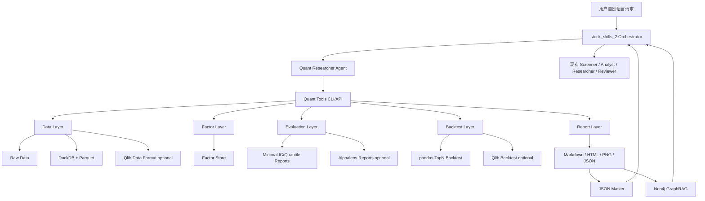

# stock_skills_2 量化功能追加：分阶段实装计划

> 对象项目：`okikusan-public/stock_skills_2`  
> 前提方案：`stock_skills_2_quant_extension_plan.md`  
> 目标：在不考虑实盘交易的前提下，分阶段把项目扩展为支持 **中低频因子研究、单因子评价、多因子组合回测、实验管理、AI 报告生成** 的量化研究系统。  
> 生成日期：2026-05-19

---

## 0. 执行摘要

本实装计划建议采用 **“先数据、再因子、再评价、再回测、再 Agent 化”** 的路线。不要一开始就追求完整平台，而是先做出一个可跑通的最小闭环：

```text
fixture/sample 数据 → 数据标准化 → 因子计算 → 最小 IC/分组收益评价 → pandas TopN 回测 → Markdown 报告 → Agent 调用
```

核心技术选型延续前一份方案，但按本仓库实际约束调整为“轻核心、重型框架后置”：

- **pandas / numpy**：作为 P0 确定性计算核心，先实现因子、IC/Rank IC、分组收益和 TopN 回测。
- **pyqlib(Qlib)**：作为 P1/P2 adapter；等 pandas MVP 有 golden tests 后再接入。
- **Alphalens-reloaded**：作为 optional adapter；MVP 先实现项目自有最小评价器。
- **AKShare / Tushare / BaoStock / yfinance**：作为 provider 增强；MVP 不依赖外部数据源。
- **DuckDB + Parquet**：作为本地研究数据仓库；真实 `data/quant/**` 不提交，sample/golden 数据放 `tests/fixtures/quant/`。
- **Codex `.agents` Agent 层**：保留 `stock_skills_2` 的自然语言入口、报告解释和 Reviewer 机制；`.claude` 只做 mirror。

推荐实装周期：

```text
Phase 0: 项目准备与依赖整理        2～3 天
Phase 1: Fixture + 数据 schema MVP  3～5 天
Phase 2: 因子计算 MVP              1 周
Phase 3: 最小单因子评价            1 周
Phase 4: pandas TopN 回测 MVP       1 周
Phase 5: 报告与实验管理            1 周
Phase 6: Agent 集成                1 周
Phase 7: Provider/Qlib/稳健性扩展   2～4 周
```

总计：

```text
MVP：约 3～5 周
增强版：约 8～12 周
```

---

## 1. 总体实施原则

### 1.1 先闭环，后完善

第一目标不是做出“完美量化平台”，而是做出可复现的研究闭环：

```text
固定数据版本
固定股票池
固定因子定义
固定回测参数
固定报告模板
固定实验 ID
```

只有这样，Agent 输出才有可信基础。

### 1.2 不让 LLM 参与数值计算

LLM 只负责：

```text
1. 解析自然语言请求
2. 调用确定性工具
3. 解释结果
4. 生成报告
5. Reviewer 检查风险
```

LLM 不负责：

```text
1. 手工计算 IC
2. 手工编造收益率
3. 手工估计最大回撤
4. 手工判断策略有效性
5. 直接输出买卖建议
```

所有关键数值必须来自：

```text
metrics.json
factor_summary.json
backtest_result.csv
experiment_config.yaml
```

### 1.3 每个阶段必须可验收

每个 Phase 都要有：

```text
1. 明确产物
2. 可执行命令
3. 自动测试
4. 验收标准
5. 回滚策略
```

---

## 2. 最终目标架构



---

## 3. Phase 0：项目准备与依赖整理

### 3.1 目标

建立量化功能追加的基础工程结构，确保依赖、目录、配置、CLI 框架可用。

### 3.2 预计工期

```text
2～3 天
```

### 3.3 主要任务

#### Task 0.1：新增量化目录结构

新增：

```text
src/quant/
tools/quant_data.py
tools/quant_factor.py
tools/quant_eval.py
tools/quant_backtest.py
tools/quant_report.py
tools/quant_experiment.py
config/quant_data_sources.yaml
config/quant_universe.yaml
config/quant_factors.yaml
config/quant_backtest.yaml
data/quant/
tests/fixtures/quant/
.agents/agents/quant-researcher/       # Phase 6 才填充
.claude/agents/quant-researcher/       # mirror，Phase 6 同步
```

同时更新 `.gitignore`，参照现有 `data/cache/` 规则，新增：

```text
# Quant local data (Phase 0)
data/quant/*.parquet
data/quant/*.duckdb
data/quant/*.csv
data/quant/reports/
data/quant/experiments/
data/quant/raw/
data/quant/normalized/
data/quant/qlib_data/
data/quant/quant.duckdb
```

仅 `tests/fixtures/quant/*.csv` 可提交到 repo。真实行情数据和实验产物一律不提交。

#### Task 0.2：整理依赖

建议新增 `requirements-quant.txt`，并把依赖分为 core 与 optional。P0 只要求 core 安装成功：

```text
# core
pandas
numpy
pyarrow
matplotlib
pyyaml

# optional-provider
duckdb
akshare
tushare
baostock
yfinance

# optional-analysis
alphalens-reloaded
pyqlib
scipy
statsmodels
plotly
vectorbt
```

注意：

```text
1. Qlib 官方 PyPI 包名是 pyqlib，不是 qlib。
2. pyqlib / alphalens-reloaded 对 Python、pandas、numpy 版本敏感，必须 optional import。
3. 当前项目命令统一使用 `conda run -n stock-skills-2 ...`，不要假设 shell 已 activate。
4. P0 验收必须包含 `python -m pip check` 和 import smoke test。
```

#### Task 0.3：建立 CLI 框架

每个 CLI 先支持 `--help` 和 dry-run。

示例：

```bash
conda run -n stock-skills-2 python tools/quant_data.py --help
conda run -n stock-skills-2 python tools/quant_factor.py --help
conda run -n stock-skills-2 python tools/quant_eval.py --help
conda run -n stock-skills-2 python tools/quant_backtest.py --help
conda run -n stock-skills-2 python tools/quant_report.py --help
```

#### Task 0.4：建立配置读取工具

新增：

```text
src/quant/config.py
```

职责：

```text
1. 读取 YAML
2. 校验必要字段
3. 输出统一 Config object
4. 记录 config hash
```

### 3.4 产物

```text
1. requirements-quant.txt
2. src/quant/ 基础 package
3. tools/quant_*.py CLI stub
4. config/quant_*.yaml 初版
5. data/quant/ 目录
```

### 3.5 验收标准

```text
1. `conda run -n stock-skills-2 python -m pip install -r requirements-quant.txt` core 依赖成功
2. 所有 quant CLI 可执行 --help
3. pytest 能正常运行，不破坏原项目测试
4. import src.quant 不报错
5. optional 依赖缺失时 CLI 能明确提示而不是崩溃
```

### 3.6 风险

| 风险 | 应对 |
|---|---|
| pyqlib 安装失败 | 先将 Qlib 设为 optional，Phase 1～4 不依赖 Qlib |
| 依赖版本冲突 | 用独立 venv / conda env；锁定版本 |
| 原项目测试被破坏 | quant 依赖放入独立 requirements-quant.txt |

---

## 4. Phase 1：Fixture + 数据 Schema MVP

### 4.1 目标

完成固定 sample universe 的行情、基础估值字段、交易日历、股票池 schema、落地与质量检查。此阶段不依赖 AKShare/BaoStock/Tushare/yfinance，目的是先建立可测试、可复现的数据契约。

### 4.2 预计工期

```text
3～5 天
```

### 4.3 范围

MVP 只支持：

```text
市场：A股
数据源：tests/fixtures/quant 固定样本（yfinance 下载一次后固化，后续不再依赖网络）
频率：日频
数据：OHLCV、成交额、换手率、PE、PB、ST 状态、交易日历
股票池：sample_a（50~100 只股票，覆盖 2~3 年，建议 2022-01-01 至 2024-12-31）
  - 50~100 只可产生有意义的 IC 统计（>24 截面）和五分位分组（每组 10~20 只）
  - 2~3 年覆盖不同市场环境（上涨/下跌/震荡），能产出初步的分年份稳健性
  - 股票选择应覆盖不同市值和行业，避免集中偏误
```

### 4.4 主要任务

#### Task 1.1：定义标准 Schema

新增：

```text
src/quant/data/schema.py
tests/fixtures/quant/sample_daily_bar.csv
tests/fixtures/quant/sample_daily_basic.csv
tests/fixtures/quant/sample_calendar.csv
tests/fixtures/quant/sample_universe.csv
```

标准表：

```text
dim_security
calendar
daily_bar
daily_basic
universe_member
```

`daily_bar` 标准字段：

```text
date
symbol
market
open
high
low
close
adj_close
volume
amount
turnover
source
updated_at
```

#### Task 1.2：实现 Fixture Provider

新增：

```text
src/quant/data/providers/base.py
src/quant/data/providers/fixture_provider.py
```

职责：

```text
1. 定义 provider 返回 DataFrame 的标准字段
2. 从 tests/fixtures/quant 读取 sample 数据
3. 返回统一 pandas DataFrame
4. 不访问网络
5. 支持 golden file test
```

AKShare、BaoStock、Tushare provider 移到 Phase 7。

#### Task 1.3：落地 Parquet / CSV

新增：

```text
src/quant/data/storage.py
```

目录：

```text
data/quant/parquet/daily_bar/
data/quant/parquet/daily_basic/
data/quant/parquet/dim_security/
data/quant/parquet/calendar/
```

DuckDB 放到 Phase 7，避免 P0/P1 被额外依赖阻塞。

#### Task 1.4：实现数据质量检查

新增：

```text
src/quant/data/quality_check.py
```

检查项：

```text
1. OHLC 合法性：high >= max(open, close, low)
2. 成交量非负
3. 日期是否为交易日
4. 单股票连续缺失天数
5. adj_close 是否异常跳变
6. 股票池数量是否异常变化
7. fixture row count / date range / hash 是否匹配 golden expectation
```

### 4.5 CLI 示例

```bash
conda run -n stock-skills-2 python tools/quant_data.py update \
  --market cn \
  --source fixture \
  --start 2024-01-01 \
  --end 2024-12-31 \
  --tables daily_bar,daily_basic,dim_security,calendar
```

```bash
conda run -n stock-skills-2 python tools/quant_data.py check \
  --market cn \
  --source fixture \
  --start 2024-01-01 \
  --end 2024-12-31
```

### 4.6 产物

```text
1. tests/fixtures/quant/*.csv
2. 标准化 sample Parquet 或 CSV 输出
3. 数据质量报告 data/quant/reports/data_quality/*.md
4. 数据版本文件 data/quant/data_version.json
5. golden expectation: tests/fixtures/quant/expected_data_version.json
```

### 4.7 验收标准

```text
1. 不联网也能跑通数据层测试
2. daily_bar 字段标准化完成
3. 数据质量检查能输出报告
4. fixture row count / date range / hash 可验证
5. 不读取个人 PF，不需要任何 API key
```

### 4.8 测试用例

```text
tests/quant/data/test_schema.py
tests/quant/data/test_storage.py
tests/quant/data/test_quality_check.py
tests/quant/data/test_fixture_provider.py
```

### 4.9 风险

| 风险 | 应对 |
|---|---|
| sample 数据过小导致指标失真 | 明确 sample 只用于工程验收，不用于投资结论 |
| 字段中文/英文不统一 | schema.py 统一映射 |
| 真实 provider 接入后字段变化 | Provider 层隔离，Phase 7 加 mock/fallback 测试 |

---

## 5. Phase 2：因子计算 MVP

### 5.1 目标

实现第一批基础因子，形成稳定的 factor store。MVP 只选 sample fixture 能确定验证的因子，避免一开始引入公告日/PIT 不完整的财务因子。

### 5.2 预计工期

```text
1 周
```

### 5.3 MVP 因子范围

第一批只实现 3 个因子：

```text
1. value_bp        = 1 / PB
2. momentum_12_1   = 过去12个月收益，排除最近1个月
3. lowvol_60d      = 过去60日收益波动率，取反向
```

`value_ep`、`roe_factor` 放到 Phase 7 provider/PIT 增强。不要用 `quality_roe` 命名，避免和现有 `tools/scoring.py::score_quality` 的三轴质量评分混淆。

### 5.4 主要任务

#### Task 2.1：因子基类

新增：

```text
src/quant/factors/base.py
```

定义：

```text
FactorConfig
FactorResult
BaseFactor.compute()
BaseFactor.validate_input()
BaseFactor.save()
```

#### Task 2.2：实现 Value 因子

新增：

```text
src/quant/factors/value.py
```

包含：

```text
value_bp
```

注意：

```text
PB <= 0 的股票应设为 NaN。
```

#### Task 2.3：实现 Momentum 因子

新增：

```text
src/quant/factors/momentum.py
```

定义：

```text
momentum_12_1 = adj_close[t-21] / adj_close[t-252] - 1
```

或者：

```text
momentum_12_1 = return over [t-252, t-21]
```

#### Task 2.4：实现 Low Vol 因子

新增：

```text
src/quant/factors/low_volatility.py
```

定义：

```text
lowvol_60d = - std(daily_return, 60)
```

#### Task 2.5：因子后处理

新增：

```text
src/quant/factors/processing.py
```

处理：

```text
1. winsorize
2. zscore
3. rank percentile
4. 行业中性化，可 Phase 7 再增强
5. 市值中性化，可 Phase 7 再增强
```

### 5.5 标准输出

```text
data/quant/factors/factor_value.parquet
```

字段：

```text
date
symbol
factor_name
raw_value
winsorized_value
zscore
percentile
direction
universe
source_version
created_at
```

### 5.6 CLI 示例

```bash
conda run -n stock-skills-2 python tools/quant_factor.py compute \
  --market cn \
  --universe sample_a \
  --factors value_bp,momentum_12_1,lowvol_60d \
  --start 2024-01-01 \
  --end 2024-12-31
```

### 5.7 产物

```text
1. 因子计算模块
2. factor_value.parquet
3. 因子覆盖率报告
4. 因子分布图
```

### 5.8 验收标准

```text
1. 每个因子能输出 date-symbol 粒度结果
2. 因子覆盖率与 sample fixture 的 expected coverage 一致
3. zscore 均值接近 0，标准差接近 1
4. 对异常 PB 有处理逻辑
5. 支持重复运行且结果可覆盖或版本化
```

### 5.9 测试用例

```text
tests/quant/factors/test_value.py
tests/quant/factors/test_momentum.py
tests/quant/factors/test_lowvol.py
tests/quant/factors/test_processing.py
```

---

## 6. Phase 3：最小单因子评价

### 6.1 目标

先实现不依赖 Alphalens 的最小评价器，输出 IC、Rank IC、forward return、分组收益和覆盖率。Alphalens-reloaded 放到 Phase 7 adapter。

### 6.2 预计工期

```text
1 周
```

### 6.3 主要任务

#### Task 3.0：Golden 校准（必须先于 3.1~3.4）

新增：

```text
tests/quant/evaluation/test_golden_calibration.py
```

此脚本用 `tests/fixtures/quant` 的固定 sample 数据，同时运行 `minimal_runner` 和 Alphalens-reloaded（如果环境支持），将 Alphalens 的 `ic_summary` 和 `quantile_returns` 保存为 golden。如果 Alphalens 装不上，用手工 numpy/pandas 计算一组预期值作为 golden。

校准要求：

```text
1. minimal_runner 输出的 IC 均值、Rank IC 均值、分组收益均值与 golden 偏差 < 0.01
2. golden 数据存入 tests/fixtures/quant/expected_ic_summary.json
3. minimal_runner 的 CI 测试必须对比 golden，不得仅自洽通过
4. 如果未来修改了因子定义或评价逻辑，必须重新运行 golden 校准
```

未通过 golden 校准的 `minimal_runner` 不得用于产生研究结论。

#### Task 3.1：构造评价输入

新增：

```text
src/quant/evaluation/input_builder.py
```

输入：

```text
factor_value.parquet
daily_bar adj_close
```

输出：

```text
DataFrame columns:
date
symbol
factor_name
factor_zscore
forward_return_5d
forward_return_20d
forward_return_60d
```

#### Task 3.2：计算 IC / Rank IC / 分组收益

新增：

```text
src/quant/evaluation/minimal_runner.py
src/quant/evaluation/ic_analysis.py
src/quant/evaluation/quantile_analysis.py
```

默认参数：

```text
periods = [5, 20, 60]
quantiles = 5
min_coverage = 0.80
```

#### Task 3.3：指标导出

新增：

```text
src/quant/evaluation/exporter.py
```

导出：

```text
factor_summary.json
ic_timeseries.csv
quantile_returns.csv
coverage.json
```

#### Task 3.4：Markdown 报告初版

新增：

```text
src/quant/reports/factor_report.py
```

报告包含：

```text
1. 因子定义
2. 数据区间
3. 股票池
4. IC / Rank IC Summary
5. 分组收益
6. 覆盖率
7. 初步结论
8. 风险提示
```

### 6.4 CLI 示例

```bash
conda run -n stock-skills-2 python tools/quant_eval.py run \
  --market cn \
  --universe sample_a \
  --factor momentum_12_1 \
  --periods 5,20,60 \
  --start 2024-01-01 \
  --end 2024-12-31
```

### 6.5 产物

```text
data/quant/reports/factor_eval/momentum_12_1/
├─ config.yaml
├─ factor_summary.json
├─ ic_timeseries.csv
├─ quantile_returns.csv
├─ coverage.json
└─ report.md
```

### 6.6 验收标准

```text
1. momentum_12_1 可以生成 IC / Rank IC 序列
2. 可以输出 5D/20D/60D forward return 分析
3. 可以输出五分位收益
4. 可以输出 Markdown 报告
5. 如果数据缺失过多，报告明确提示 coverage 问题
```

### 6.7 测试用例

```text
tests/quant/evaluation/test_input_builder.py
tests/quant/evaluation/test_ic_summary.py
tests/quant/evaluation/test_quantile_analysis.py
tests/quant/evaluation/test_factor_report.py
```

---

## 7. Phase 4：pandas TopN 回测 MVP

### 7.1 目标

使用 pandas 跑通月频 TopN 因子组合回测，并输出可复现 artifact。Qlib 放到 Phase 7 adapter，不作为 MVP 阻塞项。

### 7.2 预计工期

```text
1 周
```

### 7.3 MVP 策略

只做两个策略：

```text
1. 单因子 TopN 等权
2. 多因子 composite score TopN 等权
```

多因子 composite score：

```text
score = 0.34 * value_bp_zscore
      + 0.33 * momentum_12_1_zscore
      + 0.33 * lowvol_60d_zscore
```

MVP 默认参数（适配 50~100 只股票的 sample_a）：

```yaml
market: cn
universe: sample_a        # 50~100 只
benchmark: sample_equal_weight  # 等权基准
start_date: 2022-01-01
end_date: 2024-12-31
rebalance_frequency: monthly
topn: 10                  # 50~100 只中选 Top10，持仓集中度合理
transaction_cost:
  buy_cost: 0.0015
  sell_cost: 0.0025
  min_cost: 5
```

### 7.4 主要任务

#### Task 4.1：信号生成

新增：

```text
src/quant/backtest/signal_builder.py
```

职责：

```text
1. 单因子 score
2. 多因子 score
3. score 标准化
4. 输出 signal.parquet
```

#### Task 4.2：pandas 回测 Runner

新增：

```text
src/quant/backtest/pandas_runner.py
```

职责：

```text
1. 读取 backtest config
2. 月频选择 TopN
3. 等权持仓
4. 计算交易、换手、组合净值
5. 导出账户曲线、持仓、交易、指标
```

#### Task 4.3：成本模型

新增：

```text
src/quant/backtest/cost_model.py
```

MVP 参数：

```text
buy_cost: 0.0015
sell_cost: 0.0025
min_cost: 5
```

#### Task 4.4：结果指标

新增：

```text
src/quant/backtest/metrics.py
```

指标：

```text
annual_return
annual_volatility
sharpe
max_drawdown
calmar
turnover
excess_return
benchmark_return
```

### 7.5 CLI 示例

```bash
conda run -n stock-skills-2 python tools/quant_backtest.py run \
  --market cn \
  --universe sample_a \
  --score composite_v1 \
  --strategy topn_equal_weight \
  --topn 10 \
  --rebalance monthly \
  --start 2022-01-01 \
  --end 2024-12-31
```

### 7.6 产物

```text
data/quant/experiments/EXP_YYYYMMDD_cn_backtest_xxxxxx/
├─ config.yaml
├─ data_version.json
├─ signal.parquet
├─ portfolio_value.csv
├─ positions.csv
├─ trades.csv
├─ metrics.json
├─ charts/
│  ├─ equity_curve.png
│  ├─ drawdown.png
│  └─ yearly_return.png
└─ report.md
```

### 7.7 验收标准

```text
1. 能跑通 sample universe 的月频回测
2. 能输出 portfolio_value.csv
3. 能输出 metrics.json
4. 能输出收益曲线和回撤图
5. 支持单因子与 composite score 两种输入
6. 同一 config + 同一 data_version 重跑结果一致
```

### 7.8 测试用例

```text
tests/quant/backtest/test_signal_builder.py
tests/quant/backtest/test_pandas_runner.py
tests/quant/backtest/test_metrics.py
tests/quant/backtest/test_cost_model.py
```

### 7.9 风险

| 风险 | 应对 |
|---|---|
| sample 数据过短导致指标不稳定 | 明确 sample 仅用于工程验收 |
| 回测结果和预期不一致 | 固定样本数据做 snapshot/golden test |
| 后续 Qlib 结果不同 | Qlib adapter 单独验收，不反向改写 pandas MVP artifact |

---

## 8. Phase 5：实验管理与报告系统

### 8.1 目标

让每次因子评价和回测都有唯一 experiment_id、完整配置、指标、图表、报告和可追溯数据版本。报告中的关键数值只能来自 artifact，Agent 不得手写或改写数值。

### 8.2 预计工期

```text
1 周
```

### 8.3 主要任务

#### Task 5.1：Experiment Registry

新增：

```text
src/quant/experiments/registry.py
```

职责：

```text
1. 创建 experiment_id
2. 保存 config
3. 保存 data_version
4. 保存 artifact path
5. 保存 status: running/success/failed
6. 支持查询历史实验
```

#### Task 5.2：Config Hash

新增：

```text
src/quant/experiments/config_hash.py
```

用途：

```text
相同 config + 相同 data_version 应产生相同 hash，便于复现和去重。
```

#### Task 5.3：报告生成器

新增：

```text
src/quant/reports/markdown_report.py
```

报告分为：

```text
1. factor_eval_report
2. backtest_report
3. experiment_compare_report
```

#### Task 5.4：图表生成器

新增：

```text
src/quant/reports/charts.py
```

图表：

```text
1. IC 时间序列
2. 分位数组合收益
3. 多空组合收益
4. 策略净值曲线
5. 回撤曲线
6. 年度收益柱状图
7. 月度收益热力图
```

#### Task 5.5：JSON/Neo4j 写入适配

对接现有项目的 JSON master + Neo4j view 思路：

```text
1. report summary 写入 data/history/quant/*.json
2. 可选写入 Neo4j
3. Neo4j 不可用时 graceful degradation
```

### 8.4 CLI 示例

```bash
conda run -n stock-skills-2 python tools/quant_experiment.py list --limit 20
```

```bash
conda run -n stock-skills-2 python tools/quant_report.py generate \
  --experiment-id EXP_20260519_cn_backtest_abc123 \
  --format markdown
```

### 8.5 产物

```text
1. experiment registry
2. report.md
3. charts/*.png
4. data/history/quant/*.json
```

### 8.6 验收标准

```text
1. 每次实验都有 experiment_id
2. 每次实验都能找到 config.yaml
3. 每次实验都能找到 metrics.json
4. 报告中的关键数值能回溯到 metrics.json
5. Neo4j 不可用时不影响报告生成
6. HTML/Plotly 报告不属于 MVP 验收项
```

---

## 9. Phase 6：Agent 集成

### 9.1 目标

将量化功能接入 `stock_skills_2` 的自然语言 Agent 体系，使用户可以通过自然语言触发因子评价、回测、报告生成和实验查询。同时建立 Quant Researcher 与现有 Strategist/Analyst/Reviewer 的协作机制。

### 9.2 预计工期

```text
1 周
```

### 9.3 主要任务

#### Task 6.1：新增 Quant Researcher Agent 定义

新增：

```text
.agents/agents/quant-researcher/agent.md
.agents/agents/quant-researcher/examples.yaml
.claude/agents/quant-researcher/agent.md       # mirror
.claude/agents/quant-researcher/examples.yaml  # mirror
```

`agent.md` 必须编码以下角色边界（详情参照方案 11.0~11.1）：

```text
允许输出：
  ✅ 因子 IC/Rank IC/ICIR、分组收益、换手率等统计数据
  ✅ 回测指标（Sharpe, MaxDD, annual_return 等）及实验参数
  ✅ 稳健性分析（分年份、分市值、分行业）
  ✅ "样本不足，这不构成有效研究结论" 等诚实边界声明

禁止输出：
  ❌ 买卖建议、配置建议、"推荐"等投资决策用语
  ❌ 手工编造/估计/猜测回测结果
  ❌ 在没有 experiment_id 的情况下引用具体数值
  ❌ 把相关性说成因果关系

协作接口：
  - 被 Strategist 调用时，传递 experiment_id + metrics 摘要 + 风险标注（见方案 11.0.2）
  - 被 Analyst 调用时，传递 factor_exposure dict + coverage_flag + data_date
  - 独立执行时，仅输出研究报告，不附加投资建议
```

职责：

```text
1. 解析量化研究请求，判断属于类型 A/B/C/D（见方案 11.0.1）
2. 选择 quant CLI（compute/run/generate/list）
3. 检查必要参数（universe, factor, start_date, end_date）
4. 执行工具并生成 artifact
5. 按接口约定传递结构化数据给下游 Agent
6. 调用 Reviewer
```

`examples.yaml` few-shot 示例需覆盖：

```text
1. 纯因子评价（类型 A）
2. 纯回测请求（类型 A）
3. 策略判断 + 回测（类型 B，chain strategist）
4. 个股因子暴露查询（类型 C，被 Analyst 调用）
5. 实验查询（类型 A）
6. sample 数据不足时的拒绝话术（"样本不足"模板）
7. optional dependency 缺失时的降级提示
```

#### Task 6.2：修改 routing.yaml

新增意图时按当前 `routing.yaml` 的 flat examples 风格写入，不使用 `intent + examples[]` 嵌套格式，除非同步修改 `src/orchestrator/dry_run.py`。

```yaml
# === 纯量化研究（类型 A）===
- intent: "测试动量因子的IC"
  agent: quant-researcher
  pattern: B
  header: "🎯 [quant-researcher] 因子评价"

- intent: "看一下BP因子的分组收益"
  agent: quant-researcher
  pattern: B
  header: "🎯 [quant-researcher] 因子分组收益"

- intent: "用BP、动量和低波做月频回测"
  agent: quant-researcher
  pattern: B
  header: "🎯 [quant-researcher] 量化回测"

# === 策略判断 + 量化（类型 B）===
- intent: "这个多因子策略在A股表现怎么样"
  agent: quant-researcher
  chain: strategist
  pattern: C
  header: "🎯 [quant-researcher → strategist] 策略评估"

# === 个股 + 因子暴露（类型 C）===
- intent: "看看这只股票的因子暴露"
  agent: analyst
  chain: quant-researcher
  pattern: C
  header: "🎯 [analyst + quant-researcher] 个股分析与因子暴露"

# === 实验查询 ===
- intent: "把刚才的回测生成研究报告"
  agent: quant-researcher
  pattern: B
  header: "🎯 [quant-researcher] 量化研究报告"

- intent: "列出最近的回测实验"
  agent: quant-researcher
  pattern: A
  header: "🎯 [quant-researcher] 实验查询"
```

注意：
- 如果 quant 类 intent 与现有 screener/analyst intent 文本有交集，长匹配优先，或对含 `quant` 关键词的请求加权
- 同时更新 `src/orchestrator/dry_run.py::_expected_tools_for_agent()`，为 `quant-researcher` 增加 `quant_factor.compute`、`quant_eval.run`、`quant_backtest.run`、`quant_report.generate`、`quant_experiment.list`

#### Task 6.3：修改 orchestration.yaml

新增协作和降级规则（详情参照方案 11.0.3）：

```yaml
# === Quant Researcher 协作规则 ===

# 类型 B：策略问题 → quant 先产出 artifact，strategist 再判断
quant_on_strategy_question:
  when: "用户请求同时包含策略回测和投资判断意图"
  chain:
    - quant-researcher
    - strategist
  reviewer: auto
  fallback: "若 quant 失败，strategist 继续但标注「缺乏回测验证」"

# 类型 C：个股分析 + 因子暴露
quant_on_stock_analysis:
  when: "Analyst 执行且用户请求包含因子/量化关键词"
  chain:
    - quant-researcher
    - analyst
  reviewer: on_demand

# 类型 D：PF 诊断 + 因子归因
quant_on_pf_diagnosis:
  when: "Health Checker 执行且涉及因子暴露/风格归因"
  chain:
    - health-checker
    - quant-researcher
    - strategist
  reviewer: auto

# 独立量化任务
quant_standalone:
  when: "纯量化研究请求，不含投资判断"
  agent: quant-researcher
  reviewer: on_demand

# 故障降级
quant_failure:
  when: "quant-researcher 因数据/依赖不足无法产出 artifact"
  action: "下游 Agent 继续执行，但必须标注「缺乏量化回测验证」"
```

#### Task 6.4：更新 Reviewer 检查清单

在现有 Reviewer 的检查逻辑中新增量化双层检查（详情参照方案 11.3）：

**Layer 1 — Artifact 完整性（Quant 独立输出时）**：

```text
 1. 是否有 experiment_id
 2. 是否有数据区间
 3. 是否说明股票池
 4. 是否说明交易成本
 5. 是否说明调仓频率
 6. 是否说明是否行业中性
 7. 是否存在未来函数风险
 8. 是否存在幸存者偏差风险
 9. 是否有样本外检验
10. 是否把相关性误写成因果关系
11. 是否输出了买卖建议（违规检查）⚠️
12. sample 数据是否不足以支撑统计结论（样本量/时间跨度不足警告）
```

**Layer 2 — 引用一致性（Quant 被 Strategist/Analyst 引用时）**：

```text
13. Strategist 引用的收益率/Sharpe/MaxDD 是否与 metrics.json 一致
14. 是否选择性引用有利指标而忽略不利指标
15. 当量化证据与 Strategist 判断矛盾时，是否标注了矛盾
16. Strategist 是否在没有 artifact 的情况下编造了量化数据
```

#### Task 6.5：更新 config/tools.yaml

在 `config/tools.yaml` 中新增 quant tools 的函数登记，使 Agent 能通过标准化方式发现可用工具：

```yaml
- name: quant_factor.compute
  role: quant-researcher
  description: "计算指定因子的值、zscore、percentile"
  when_to_use: "用户请求因子计算、IC分析或回测前"

- name: quant_eval.run
  role: quant-researcher
  description: "运行最小因子评价，输出IC、Rank IC、分组收益"
  when_to_use: "用户请求因子有效性评估"

- name: quant_backtest.run
  role: quant-researcher
  description: "运行pandas TopN等权回测，输出组合净值和指标"
  when_to_use: "用户请求策略回测"

- name: quant_report.generate
  role: quant-researcher
  description: "根据实验ID生成Markdown研究报告"
  when_to_use: "回测或因子评价完成后"

- name: quant_experiment.list
  role: quant-researcher
  description: "列出历史实验记录"
  when_to_use: "用户请求查看或比较历史实验"
```

#### Task 6.6：更新 Strategist/Analyst 的 agent.md

本 Phase 不要求大改 Strategist 和 Analyst，但需要追加最小协作说明：

**Strategist agent.md 追加**：

```text
量化证据使用规则：
  - 当做投资判断并引用回测结果时，必须引用 experiment_id
  - 如果 experiment registry 中无对应实验，必须说「该策略缺乏回测验证」，不得估计收益
  - 当你的判断与量化证据矛盾时（如你看好但回测 Sharpe < 0），必须标注矛盾并建议重新审视
  - 不得选择性引用有利的量化指标而忽略不利的
```

**Analyst agent.md 追加**：

```text
因子暴露规则：
  - 因子暴露数据放在「量化因子暴露」小节，不与估值判断混淆
  - 如果目标股票不在因子覆盖范围内，标注「无因子覆盖数据」
  - 不把因子分位数直接等同于「好/坏」，只陈述事实
```

### 9.4 自然语言验收场景

#### 场景 1：单因子评价（类型 A）

用户输入：

```text
测试 A股 sample 股票池的 momentum_12_1 因子，2022 到 2024，看 20日和60日 IC、分组收益。
```

系统应执行：

```text
conda run -n stock-skills-2 python tools/quant_factor.py compute
conda run -n stock-skills-2 python tools/quant_eval.py run
conda run -n stock-skills-2 python tools/quant_report.py generate
reviewer check（Layer 1 清单）
```

成功标准：输出 experiment_id + report.md，不含任何买卖建议用语。

#### 场景 2：多因子回测（类型 A）

用户输入：

```text
用 BP、动量和低波做一个 A股 sample 月频 TopN 回测，2022 到 2024，生成报告。
```

系统应执行：

```text
conda run -n stock-skills-2 python tools/quant_factor.py compute
conda run -n stock-skills-2 python tools/quant_backtest.py run
conda run -n stock-skills-2 python tools/quant_report.py generate
reviewer check
```

#### 场景 3：策略判断 + 量化（类型 B）

用户输入：

```text
这个 BP+动量+低波多因子策略在 A 股 sample 上表现怎么样？值得用吗？
```

系统应执行：

```text
quant-researcher（先产出 artifact）
  → strategist（读取 artifact，结合判断给出建议）
reviewer check（Layer 1 + Layer 2 清单）
```

成功标准：
- Strategist 输出中引用了 experiment_id 和关键指标
- Strategist 标注了「回测结果不代表未来表现」
- Strategist 不自编数字
- 如果回测表现差 + Strategist 仍然看好 → 标注矛盾

#### 场景 4：实验查询（类型 A）

用户输入：

```text
列出最近 5 个量化回测实验，并比较 Sharpe 和最大回撤。
```

系统应执行：

```text
conda run -n stock-skills-2 python tools/quant_experiment.py list
conda run -n stock-skills-2 python tools/quant_experiment.py compare
```

#### 场景 5：样本不足时的拒绝话术（边界测试）

用户输入：

```text
用 10 只股票测试动量因子，2024 年 1 月到 3 月，看 IC。
```

系统应响应：

```text
Quant Researcher 检查 universe 大小和时间跨度后，输出：
"sample_a 仅有 10 只股票、3 个月数据，IC 统计不稳健，这不构成有效研究结论。建议至少使用 50 只股票、2 年数据。"
```

### 9.5 验收标准

```text
1. Agent 能正确路由到 quant-researcher
2. Agent 不编造数值（所有数值来自 artifact）
3. Agent 输出包含 experiment_id 和风险提示
4. Quant Researcher 在所有场景下未输出买卖建议（类型 A 禁止项）
5. 类型 B 场景下 Strategist 正确引用量化证据
6. Reviewer 能发现缺失的回测假设（Layer 1）和引用不一致（Layer 2）
7. 样本不足时 Agent 明确拒绝给出结论（场景 5）
8. `conda run -n stock-skills-2 python tests/e2e/run_e2e.py --dry-run` 通过
9. `conda run -n stock-skills-2 python -m pytest tests/e2e/test_mocked.py -q` 通过
10. `conda run -n stock-skills-2 python -m pytest tests/ -q` 全部通过
```

---

## 10. Phase 7：稳健性、扩展与增强

### 10.1 目标

提升研究可信度，增加多市场、多股票池、多参数、多维度稳健性分析。

### 10.2 预计工期

```text
2～4 周
```

### 10.3 增强任务

#### Task 7.1：真实数据 Provider

实现：

```text
AKShare Provider
BaoStock Provider
Tushare Provider optional
provider mock tests
provider fallback tests
```

#### Task 7.2：DuckDB + Parquet 数据仓库

实现：

```text
data/quant/quant.duckdb
incremental update
schema migration
data_version hash
```

#### Task 7.3：Alphalens Adapter

实现：

```text
src/quant/evaluation/alphalens_runner.py
optional dependency check
tear_sheet.html
```

#### Task 7.4：pyqlib(Qlib) Adapter

实现：

```text
src/quant/data/qlib_converter.py
src/quant/backtest/qlib_runner.py
optional dependency check
Qlib vs pandas artifact comparison
```

#### Task 7.5：行业中性化

实现：

```text
factor_zscore_neutral = residual of regression:
factor_zscore ~ industry_dummies + log_market_cap
```

#### Task 7.6：市值分组稳健性

输出：

```text
large_cap
mid_cap
small_cap
```

每组分别计算：

```text
IC
Rank IC
Quantile Return
Long-short Return
```

#### Task 7.7：分年份稳健性

输出：

```text
year
ic_mean
rank_ic_mean
long_short_return
turnover
```

#### Task 7.8：交易成本敏感性

测试：

```text
cost = 0bps, 10bps, 20bps, 50bps
```

#### Task 7.9：TopN 敏感性

测试：

```text
Top50
Top100
Top200
Top300
```

#### Task 7.10：调仓频率敏感性

测试：

```text
weekly
monthly
quarterly
```

#### Task 7.11：日本股/美股扩展

扩展：

```text
jp_market via yfinance / stooq / 其他免费源
us_market via yfinance
```

注意：

```text
1. 海外数据源优先做价格类因子
2. 财务类因子需要额外验证字段质量
3. yfinance 数据仅用于个人研究和教育用途
```

#### Task 7.12：vectorbt 补充实验

用于：

```text
1. 技术指标类信号快速参数网格
2. ETF 动量策略
3. 少量资产组合实验
```

不建议用于：

```text
大规模 A股横截面财务因子研究主流程
```

### 10.4 验收标准

```text
1. 每个因子都有分年份表现
2. 每个因子都有分市值组表现
3. 每个策略都有成本敏感性分析
4. 每个策略都有 TopN 敏感性分析
5. 报告中自动标注“稳健”或“不稳健”的依据
```

---

## 11. 里程碑计划

### Milestone 1：数据可用

```text
时间：第 1 周
目标：fixture/sample 数据可标准化、落地、校验
关键产物：tests/fixtures/quant/*.csv、daily_bar.parquet、data_quality_report.md
```

### Milestone 2：因子可算

```text
时间：第 1～2 周
目标：基础因子可计算并保存
关键产物：factor_value.parquet、factor_coverage_report.md
```

### Milestone 3：因子可评估

```text
时间：第 2～3 周
目标：最小单因子评价可运行
关键产物：factor_summary.json、ic_timeseries.csv、factor_report.md
```

### Milestone 4：策略可回测

```text
时间：第 3～4 周
目标：pandas 月频 TopN 回测可运行
关键产物：portfolio_value.csv、metrics.json、backtest_report.md
```

### Milestone 5：研究可复现

```text
时间：第 4 周
目标：实验管理和报告系统可用
关键产物：experiment registry、config hash、report artifacts
```

### Milestone 6：自然语言可调用

```text
时间：第 4～5 周
目标：Agent 可调用量化工具
关键产物：quant-researcher agent、routing rules、Reviewer checklist
```

### Milestone 7：研究可信度增强

```text
时间：第 6～12 周
目标：真实 provider、Qlib/Alphalens adapter、稳健性分析、多市场扩展
关键产物：provider adapters、qlib adapter、alphalens adapter、robustness_report.md
```

---

## 12. 优先级排序

### P0：必须完成

```text
1. 数据标准化 schema
2. tests/fixtures/quant sample/golden 数据
3. Fixture Provider + Parquet/CSV 落地
4. value_bp / momentum_12_1 / lowvol_60d 因子
5. 最小 IC / Rank IC / 分组收益评价
6. pandas TopN 月频回测
7. Markdown 报告
8. experiment_id
```

### P1：强烈建议完成

```text
1. Agent 自然语言路由
2. Reviewer 量化检查清单
3. 多因子 composite score
4. 数据质量检查报告
5. 交易成本模型
6. dry-run + mocked E2E
7. `config/tools.yaml` quant tools 登记
```

### P2：增强功能

```text
1. AKShare/BaoStock/Tushare provider
2. DuckDB 数据仓库
3. Alphalens-reloaded adapter
4. pyqlib(Qlib) adapter
5. value_ep / roe_factor
6. 行业/市值中性化
7. 成本/TopN/年份/行业稳健性
8. HTML 报告
9. Neo4j 图谱写入
```

### P3：后续扩展

```text
1. 日本股/美股扩展
2. vectorbt 参数网格实验
3. LightGBM 模型
4. Walk-forward validation
5. Auto factor mining
6. RD-Agent/Qlib 自动研究流程接入
```

---

## 13. 验收 Demo 设计

### Demo 1：单因子评价

命令：

```bash
conda run -n stock-skills-2 python tools/quant_factor.py compute \
  --market cn \
  --universe sample_a \
  --factor momentum_12_1 \
  --start 2022-01-01 \
  --end 2024-12-31

conda run -n stock-skills-2 python tools/quant_eval.py run \
  --market cn \
  --universe sample_a \
  --factor momentum_12_1 \
  --periods 5,20,60
```

成功标准：

```text
1. 生成 factor_value.parquet
2. 生成 factor_summary.json（IC/Rank IC 与 golden 偏差 < 0.01）
3. 生成 quantile_returns.csv
4. 生成 report.md
```

### Demo 2：多因子回测

命令：

```bash
conda run -n stock-skills-2 python tools/quant_backtest.py run \
  --market cn \
  --universe sample_a \
  --score composite_v1 \
  --strategy topn_equal_weight \
  --topn 10 \
  --rebalance monthly \
  --start 2022-01-01 \
  --end 2024-12-31
```

成功标准：

```text
1. 生成 experiment_id
2. 生成 portfolio_value.csv
3. 生成 metrics.json
4. 生成 equity_curve.png
5. 生成 backtest_report.md
```

### Demo 3：自然语言调用

用户输入：

```text
用 A股 sample 股票池测试 momentum_12_1 因子，2022 到 2024，生成 IC 和分组收益报告。
```

成功标准：

```text
1. 路由到 quant-researcher
2. 自动调用 `tools/quant_factor.py`
3. 自动调用 `tools/quant_eval.py`
4. 自动调用 `tools/quant_report.py`
5. 输出 experiment_id 和报告路径
```

---

## 14. 测试策略

### 14.1 单元测试

覆盖：

```text
1. schema 字段映射
2. provider 返回格式
3. 数据质量检查
4. 因子公式
5. winsorize / zscore
6. IC summary 计算
7. 回测 metrics
8. config hash
```

### 14.2 集成测试

覆盖：

```text
1. sample data → factor → evaluation
2. sample data → pandas backtest
3. experiment registry → report
4. routing.yaml → dry-run → mocked E2E
```

### 14.3 Mock 外部数据源

所有外部数据源必须 mock，避免 CI 依赖网络。

```text
AKShare mock
Tushare mock
BaoStock mock
yfinance mock
```

### 14.4 Golden File Test

对固定 sample 数据，保存预期结果：

```text
tests/fixtures/quant/sample_daily_bar.csv
tests/fixtures/quant/expected_factor_value.csv
tests/fixtures/quant/expected_metrics.json
```

---

## 15. 运维与使用注意事项

### 15.1 数据更新策略

MVP：

```text
手动执行 conda run -n stock-skills-2 python tools/quant_data.py update --source fixture
```

后续：

```text
每日收盘后本地定时执行
```

### 15.2 数据版本策略

每次更新生成：

```text
data/quant/data_version.json
```

包含：

```text
update_time
source
start_date
end_date
row_count
schema_version
hash
```

### 15.3 结果复现策略

每个实验保存：

```text
config.yaml
data_version.json
code_version 或 git commit hash
metrics.json
```

### 15.4 失败处理

```text
1. fixture/source check 失败：保存 failed experiment，不生成误导报告
2. optional provider 失败：fallback 到备源
3. pyqlib(Qlib) 失败：保存 traceback，提示使用 pandas MVP artifact
4. 报告生成失败：保留 metrics 和 csv
```

---

## 16. 风险矩阵

| 风险 | 严重度 | 发生概率 | 应对 |
|---|---:|---:|---|
| 免费数据源字段变化 | 高 | 高 | Provider 放到 Phase 7；Provider 隔离、mock test、fallback 数据源 |
| 财务数据存在未来函数 | 高 | 中 | 报告明确标注；后续引入公告日/PIT 处理 |
| pyqlib 安装或格式转换复杂 | 中 | 中 | Qlib 后置为 optional adapter；pandas MVP 不依赖它 |
| 回测结果不可复现 | 高 | 中 | 强制保存 config、data_version、hash |
| LLM 编造结论 | 高 | 中 | Reviewer 检查；数值必须来自 artifact |
| 项目范围膨胀 | 中 | 高 | 严格区分 P0/P1/P2/P3 |
| A股全量数据下载过慢 | 中 | 中 | 先 sample universe；支持增量更新 |

---

## 17. 推荐开发顺序

实际开发建议按照以下顺序：

```text
1. src/quant/config.py
2. src/quant/data/schema.py
3. tests/fixtures/quant/*.csv
4. src/quant/data/providers/base.py
5. src/quant/data/providers/fixture_provider.py
6. src/quant/data/storage.py
7. src/quant/data/quality_check.py
8. tools/quant_data.py
9. src/quant/factors/base.py
10. src/quant/factors/momentum.py
11. src/quant/factors/value.py
12. src/quant/factors/low_volatility.py
13. tools/quant_factor.py
14. src/quant/evaluation/minimal_runner.py
15. tools/quant_eval.py
16. src/quant/backtest/pandas_runner.py
17. tools/quant_backtest.py
18. src/quant/experiments/registry.py
19. src/quant/reports/markdown_report.py
20. tools/quant_report.py
21. .agents/agents/quant-researcher/agent.md
22. .claude/agents/quant-researcher/agent.md mirror
23. routing.yaml / orchestration.yaml 修改
```

---

## 18. 第一轮 Sprint 建议

如果按 2 周一个 Sprint：

### Sprint 1：数据 MVP

目标：

```text
fixture sample universe 日线，并落地 Parquet。
```

任务：

```text
1. schema.py
2. fixture_provider.py
3. tests/fixtures/quant
4. storage.py
5. quant_data.py
6. quality_check.py 初版
```

### Sprint 2：因子 + 最小评价器

目标：

```text
完成 momentum_12_1、value_bp、lowvol_60d，并生成最小 IC/分组收益报告。
```

任务：

```text
1. base.py
2. momentum.py
3. value.py
4. low_volatility.py
5. processing.py
6. minimal_runner.py
7. factor_report.py
```

### Sprint 3：pandas 回测

目标：

```text
跑通 composite_v1 月频 TopN 回测。
```

任务：

```text
1. pandas_runner.py
2. signal_builder.py
3. cost_model.py
4. metrics.py
5. backtest_report.py
```

### Sprint 4：Agent + 实验管理

目标：

```text
自然语言触发单因子评价和回测。
```

任务：

```text
1. experiment registry
2. quant_report.py
3. quant-researcher agent
4. routing.yaml
5. reviewer checklist
6. end-to-end demo
```

---

## 19. 最终交付物清单

MVP 结束时应交付：

```text
代码：
  src/quant/**
  tools/quant_*.py
  config/quant_*.yaml
  .agents/agents/quant-researcher/**
  .claude/agents/quant-researcher/**  # mirror

数据：
  data/quant/parquet/**
  data/quant/factors/**
  tests/fixtures/quant/**

报告：
  data/quant/reports/factor_eval/**
  data/quant/experiments/**/report.md

测试：
  tests/quant/**

文档：
  docs/quant_architecture.md
  docs/quant_user_guide.md
  docs/quant_developer_guide.md
```

---

## 20. 结论

建议不要一次性开发“大而全”的量化系统，而是按以下主线推进：

```text
Phase 1 数据可用
Phase 2 因子可算
Phase 3 因子可评估
Phase 4 策略可回测
Phase 5 实验可复现
Phase 6 Agent 可调用
Phase 7 结果更稳健
```

最小 MVP 的关键不是模型多复杂，而是：

```text
1. 数据能复现
2. 因子定义清楚
3. 回测参数透明
4. 报告数值可追溯
5. Agent 不编造结果
```

完成 MVP 后，`stock_skills_2` 就可以从“AI 投资分析助手”升级为：

```text
AI + Quant Research Copilot
```

也就是：

```text
LLM 负责理解、编排、解释、复核；
pandas MVP 负责可复现的确定性计算；
pyqlib / Alphalens / DuckDB 作为增强 adapter 扩展研究深度。
```

---

## 21. Git/GitHub 版本控制工作流

### 21.1 目标

实装过程中使用 Git 保存可回溯的开发历史，使用 GitHub 做远端备份、issue/PR 管理和 review。原则是：本地 `git` 负责真实代码状态，GitHub 插件负责远端协作对象。

### 21.2 初始设置

当前项目目录如果还不是 git repository，先执行：

```bash
git status --short
git init -b main
```

初始化后先审计 `.gitignore` 和待提交文件，确认不会提交以下内容：

```text
.env
真实 API key
个人 PF / cash balance / 私人 notes
data/quant/** 本地产物
真实行情 parquet/csv/duckdb
```

审计通过后创建 baseline commit：

```bash
git status --short
git add <audited-paths>
git commit -m "chore: baseline project before quant extension"
```

随后用 GitHub 插件或 GitHub CLI 创建远端 repo（建议 private），添加 `origin` 并推送 `main`。

### 21.3 分支与 PR

`main` 始终代表可运行基线。每个 Phase 使用独立分支：

```text
quant/phase-0-setup
quant/phase-1-data-schema
quant/phase-2-factors
quant/phase-3-evaluation
quant/phase-4-backtest
quant/phase-5-experiments
quant/phase-6-agent-integration
quant/phase-7-enhancements
```

Phase 7 是 optional enhancement，必须单独 PR，不得混入 MVP bugfix。

### 21.4 日常提交循环

每次开工：

```bash
git status --short
git switch -c quant/phase-N-short-desc
```

完成一个小闭环后：

```bash
conda run -n stock-skills-2 python -m pytest <relevant-tests> -q
git diff --check
git diff --stat
git add <changed-paths>
git commit -m "feat(quant-data): add fixture provider"
```

优先使用精确路径 `git add <changed-paths>`。只有在确认没有隐私数据、本地产物或无关变更后，才允许使用 `git add .`。

### 21.5 Phase 完成流程

每个 Phase 结束时：

```bash
conda run -n stock-skills-2 python -m pytest tests/ -q
git status --short
git push -u origin <branch>
```

用 GitHub 插件创建 PR。PR 描述必须包含：

```text
1. 完成的 checklist 项
2. 测试命令与结果
3. 数据/隐私检查结果
4. 是否涉及 optional dependency
5. 已知风险或降级行为
```

PR review 反馈在同一分支修复。不要在共享分支上使用 `git reset --hard`。合入 `main` 后为 Phase 打 tag：

```bash
git tag quant-phase-N
git push origin quant-phase-N
```
